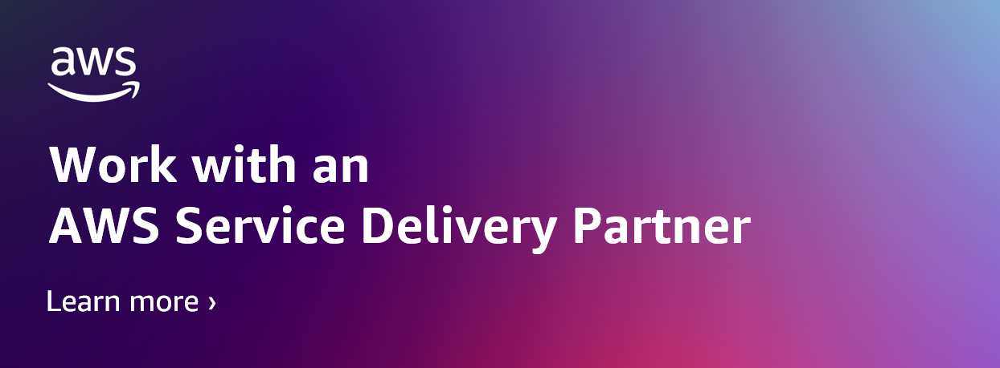
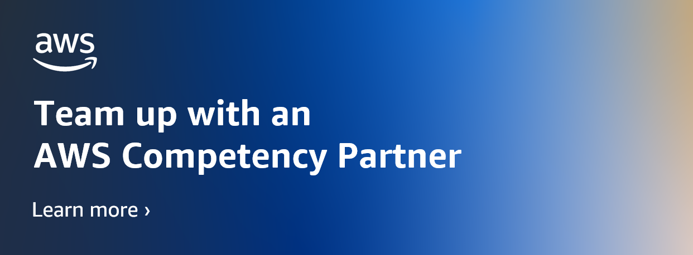
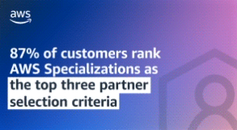
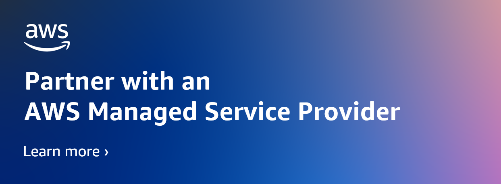

# Announcing 194 New Partners Achieving AWS Competency, Service Delivery, Service Ready, and MSP Designations in April

**Author:** Nick Paris  
**Published:** 2025/05/01  
**Category:** Announcements, APN Launches, AWS Partner Network  

---

## Introduction

Written by **Nick Paris**, Director of APN Marketing – AWS Partner Network.

The **AWS Partner Network (APN)** is a global community leveraging **Amazon Web Services (AWS)** technologies, programs, expertise, and tools to build solutions and deliver services to customers.

APN has over **130,000 partners** from more than **200 countries**, with **70% headquartered outside the United States**. Together, partners and AWS deliver innovative solutions, solve technical challenges, win contracts, and bring greater value to customers.

To achieve APN designations such as **AWS Competency**, **AWS Service Delivery**, **AWS Service Ready**, and **AWS Managed Service Provider (MSP)**, organizations must undergo rigorous technical validation and assessment processes.

---

## 🆕 AWS Competency Partners

To succeed in cloud adoption in today's complex IT environments, customers can partner with **AWS Competency Partners**.

This program validates and promotes partners with **deep technical expertise** and **proven success** through real-world projects. Guidance from these experts helps businesses achieve **better and more efficient results**.

### 🔹 New Partners

#### **AWS Advertising and Marketing Technology Competency**
- Anzu.io | EMEA | Advertising Platform; Digital Customer Experience

#### **AWS Cloud Operations Competency**
- avvale | EMEA | Cloud Financial Management  
- Qucoon | EMEA | Cloud Governance  
- Select Soluções | LATAM | Cloud Financial Management  
- ControlMonkey | EMEA | Cloud Governance; Operations Management  

#### **Consumer Goods Competency**
- AssetWatch | NAMER | Manufacturing  
- Cloudinary | NAMER | Marketing  

#### **AWS Cyber Insurance Competency**
- Measured Analytics and Insurance | NAMER | Cyber Insurance  

#### **AWS Data & Analytics Competency**
- Ankercloud | EMEA | Consulting Services  
- Trianz | NAMER | Consulting Services  

#### **AWS DevOps Competency**
- Syntax Systems | NAMER | Consulting Services  

#### **AWS Digital Workplace Competency**
- LCM Go Cloud | EMEA | Consulting Services  
- Celoxis Technologies | APAC | Collaboration Platform  

#### **AWS Education Competency**
- CloudiQS | EMEA | Consulting Services  
- CloudThat | APAC | Consulting Services  
- Wiz | NAMER | Administration and Operations  
- Zscaler | NAMER | Administration and Operations  

#### **Energy & Utilities Competency**
- Innovapptive | NAMER | Downstream; Midstream; Upstream  
- Schlumberger | NAMER | Data Analytics and Insights; Upstream  

#### **AWS Financial Services Competency**
- Blend | NAMER | Consulting Services  
- Kyriba | EMEA | Capital Markets  

#### **AWS Generative AI Competency**
- 上海南洋万邦软件技术有限公司 – Nanyang Softland | China | Consulting Services  
- ARKHO | LATAM | Consulting Services  
- Beijing Yun Shi Shu Ju Technology | China | Consulting Services  
- Blend | NAMER | Consulting Services  
- Cloudmates | EMEA | Consulting Services  
- Compie Technologies | EMEA | Consulting Services  
- Darede | LATAM | Consulting Services  
- Ganit Business Solutions | APAC | Consulting Services  
- Going Cloud | China | Consulting Services  
- GS Neotek | APAC | Consulting Services  
- Netlight Consulting | EMEA | Consulting Services  
- OMNYS | EMEA | Consulting Services  
- Singtel Group / NCS / Optus | APAC | Consulting Services  
- SnapSoft | NAMER | Consulting Services  
- SoftwareOne | EMEA | Consulting Services  
- Source Allies, Inc | NAMER | Consulting Services  
- 特赞（上海）信息科技有限公司 | China | Generative AI Applications  
- Articul8 AI | NAMER | Foundation Model and Application Development; Generative AI Applications; Infrastructure and Data  
- Feenix.ai | NAMER | Generative AI Applications  
- Informatica | NAMER | Generative AI Applications  
- Vody.com | NAMER | Generative AI Applications  

#### **AWS Government Competency**
- Inflectra Corporation | NAMER | Citizen Services  
- Over-C | EMEA | Citizen Services  
- SentinelOne | NAMER | Government Technology and Tools  

#### **AWS Healthcare Competency**
- BioT Medical | EMEA | Clinical Information Systems; Compliance Services; Healthcare Management; Population Health & Analytics  
- Wiz | NAMER | Compliance Services  

#### **AWS High Performance Computing (HPC) Competency**
- Fovus | NAMER | HPC Management  

#### **AWS Level 1 MSSP Competency**
- Comprinno Technologies | APAC | Level 1 Managed Security Services  

#### **AWS Machine Learning Competency**
- Impetus Technologies | NAMER | Consulting Services  

#### **AWS Mainframe Modernization Competency**
- Slalom | NAMER | Mainframe Workloads  

#### **AWS Manufacturing and Industrial Competency**
- Cognizant | NAMER | Enterprise Solutions; Operations Technology; Smart Manufacturing; Supply Chain Management  

#### **AWS Media & Entertainment Competency**
- AppEvolve | NAMER | Broadcast; Direct to Consumer  
- DataArt | NAMER | Media Supply Chain and Archive  

#### **AWS Migration and Modernization Competency**
- Almaviva | EMEA | Migration Services  
- Bespin Global | APAC | Modernization Services  
- ForceOne | LATAM | Migration Services  
- TrueMark Technologies | NAMER | Migration Services  

#### **AWS Networking Competency**
- Fortinet | NAMER | Consulting Services  
- Qucoon | EMEA | Consulting Services  

#### **AWS Nonprofit Competency**
- Acloud Co. | APAC | Consulting Services  
- Incline-IT (MIS Group) | EMEA | Consulting Services  
- Quantiphi | NAMER | Consulting Services  

#### **AWS Oracle Competency**
- SYSTEX RAINBOW TECH CO | China | Consulting Services  

#### **AWS Resilience Competency**
- bestcloudfor.me | EMEA | Core Resilience; Resilience Design; Resilience Operations; Disaster Recovery  
- Dedicatted | NAMER | Core Resilience; Resilience Design  

#### **AWS Retail Competency**
- Kyndryl | NAMER | Consulting Services  
- Oneture Technologies | APAC | Consulting Services  
- Tredence | NAMER | Consulting Services  
- Netop | EMEA | Core IT and Applications  
- Spectro Cloud | NAMER | Core IT and Applications  

#### **AWS SaaS Competency**
- MethodData | NAMER | Builder; Design Services  

#### **AWS Security Competency**
- RISCPoint | NAMER | Compliance and Privacy  

#### **AWS Small and Medium Business (SMB) Competency**
- 神灏（北京）云计算科技有限公司 | China | Small and Medium Business  
- 北京聚云立方科技有限公司（Marshotspot limited) | China | Small and Medium Business  
- Chunghwa Telecom | China | Small and Medium Business  
- Entel | LATAM | Small and Medium Business  
- Intelligence Cloud Sphere- (Intel CS) | EMEA | Small and Medium Business  
- Nanjing OnCloud AI Co | China | Small and Medium Business  
- Nub8 | NAMER | Small and Medium Business  
- Trek10 | NAMER | Small and Medium Business  

#### **AWS Storage Competency**
- ECLOUDVALLEY TECHNOLOGY | APAC | Consulting Services  
- Effectual | NAMER | Consulting Services  
- Kyndryl | NAMER | Consulting Services  

#### **AWS Travel and Hospitality Competency**
- DataDome | EMEA | Core Applications; Digital Customer Engagement  

---

## 🆕 AWS Managed Service Providers (MSP)

The **AWS Managed Service Provider (MSP)** program validates partners with **experience delivering comprehensive AWS solutions**, including:
- Planning and design  
- Build and migration  
- Operations and support  
- Automation and optimization  

### **Latest MSP Partners**
- Dedicatted | NAMER  
- Genpact | NAMER  
- Globant | LATAM  

---

## 🆕 AWS Service Ready Products

The **AWS Service Ready** program validates software products built by AWS Partners, ensuring **good integration and compatibility** with specific AWS services.

### **Latest Products**

#### **Amazon CloudFront Compatible Products**
- 北京智齿博创科技有限公司 | China | Media Management; Monitoring & Analytics; Security  
- UDS | LATAM | Media Management  

#### **Amazon Linux Compatible Products**
- Cloudpense | China | Amazon Linux 2  
- Tacnode | NAMER | Amazon Linux 2022  

#### **Amazon RDS Compatible Products (Business Applications & Tools)**
- 太美医疗科技 | China | Business Applications  
- 福州领克狐科技有限公司 | China | Business Applications  
- iPinYou Inc | China | Business Applications  
- SF-DHL | China | Business Applications  

#### **AWS Graviton Ready Products**
- Share Creators Inc. | China | Application Stacks  

---

## 🆕 AWS Service Delivery Partners

The **AWS Service Delivery** program validates AWS Partners with **deep technical knowledge**, **experience**, and **proven success** in delivering specific AWS services to customers.

### **Latest Partners:**

#### **Amazon API Gateway Delivery Partners**
- ADAPTURE Technology Group | NAMER  
- Intellergy | EMEA  
- Kinu | NAMER  

#### **Amazon CloudFront Delivery Partners**
- Bion Solutions | EMEA  
- Caylent | NAMER  
- IT Visionary | EMEA  
- Kinu | NAMER  
- NCLOUD THREE INFORMATION TECHNOLOGY | EMEA  
- Techpartner Alliance | APAC  

#### **Amazon Connect Delivery Partners**
- TEKsystems Global Services | NAMER  

#### **Amazon DynamoDB Delivery Partners**
- Bexprt | EMEA  
- Business Compass | NAMER  
- Kinu | NAMER  

#### **Amazon EC2 for Microsoft Windows Server Delivery Partners**
- 博博未来科技（深圳）有限公司 | China  
- Bourntec Solutions | NAMER  
- Conviso | NAMER  
- DAIWABO INFORMATION SYSTEM | Japan  
- Innovative Digital Transformation | NAMER  
- Intelecta | LATAM  
- Mindware | EMEA  
- Registfy | EMEA  
- RSNA Cloud Connect | NAMER  
- Sedmi Odjel | EMEA  
- Shenzhen Indusfour Technology | China  
- SHINRAI TECHNOLOGIES | EMEA  

#### **AWS Systems Manager Delivery Partners**
- ADAPTURE Technology Group | NAMER  
- Cloud TechOn | APAC  
- Noventiq | EMEA  

#### **Amazon ECS Delivery Partners**
- Cloudster | LATAM | Containers  
- Decryptogen | | Compute; Containers; Serverless  
- Kinu | NAMER | Containers  
- Lauren Information Technologies (Ataloud) | APAC | Compute; Containers; Serverless  
- Skyloop Cloud | EMEA | Compute; Containers; Serverless  
- SKYLOUD | EMEA | Containers  
- VArrow Technologies | EMEA | Compute; Containers; Serverless  

#### **Amazon EKS Delivery Partners**
- CodetoKloud Inc | NAMER  
- Decryptogen |  
- Global Mobility Services | NAMER  
- Lauren Information Technologies Private Limited (Ataloud) | APAC  
- MOVE2CLOUD | EMEA  
- Visionet Systems | NAMER  

#### **Amazon EMR Delivery Partners**
- ADAPTURE Technology Group | NAMER  
- Stack | LATAM  

#### **Amazon Kinesis Delivery Partners**
- ADAPTURE Technology Group | NAMER  
- Mactores Cognition Inc | NAMER  
- Nublit by Domus Global | LATAM  

#### **Managed Streaming for Kafka (MSK) Delivery Partners**
- Woodmark Consulting AG | EMEA  

#### **Amazon OpenSearch Delivery Partners**
- Datamellon | EMEA | Log Analytics; Search  
- Lauren Information Technologies (Ataloud) | APAC | Log Analytics; Search  

#### **Amazon RDS Delivery Partners**
- Comprinno Technologies | APAC | Amazon RDS for MySQL; Amazon RDS for PostgreSQL  
- Epsilon srl | EMEA | Amazon Aurora MySQL  
- Kinu | NAMER | Amazon RDS for PostgreSQL  
- kloudr | EMEA | Amazon Aurora MySQL  
- Osam International | APAC | Amazon Aurora PostgreSQL; Amazon RDS for MySQL  
- RISCPoint | NAMER | Amazon Aurora MySQL; Amazon Aurora PostgreSQL; Amazon RDS for MySQL; Amazon RDS for PostgreSQL  
- TemaBit | EMEA | Amazon Aurora PostgreSQL; Amazon RDS for MySQL  
- Yalantis | EMEA | Amazon RDS for PostgreSQL  

#### **Amazon Redshift Delivery Partners**
- Applogika | NAMER  
- Ironside Group | NAMER  
- Zensar | NAMER  

#### **AWS CloudFormation Delivery Partners**
- Altostruct AB | EMEA  
- CloudThat | APAC  

#### **AWS Config Delivery Partners**
- ProfiSea | EMEA  
- SoftGEM Global Technologies | EMEA  

#### **AWS Control Tower Delivery Partners**
- DFX5 | NAMER | Container; Database; Infrastructure as a Service; Migration; Networking; Security; Serverless; Storage  
- IONAIM INNOVATIONS | APAC | Machine Learning; Security  
- Kinu | NAMER | Networking; Security  
- MyOps | EMEA | Infrastructure as a Service; Networking; Security  
- Pentagon System and Services | APAC | Infrastructure as a Service; Serverless  
- Rego Consulting Corporation | NAMER | Migration; Security  
- RISCPoint | NAMER | Networking; Security  
- Wipro | APAC | Infrastructure as a Service  

#### **AWS Direct Connect Partners (ISV and SI)**
- Telekomunikasi Indonesia International | APAC  

#### **AWS Glue Delivery Partners**
- Decryptogen |  
- In Motion | LATAM  
- Lauren Information Technologies (Ataloud) | APAC  
- Renoir Consulting | APAC  

#### **AWS GovCloud (US) Delivery Partners**
- TEKsystems Global Services | NAMER  

#### **AWS Graviton Delivery Partners**
- onkatec | EMEA  
- OpsTree Solutions | APAC  

#### **AWS Lambda Delivery Partners**
- ADAPTURE Technology Group | NAMER  
- Bexprt | EMEA  
- CloudZenia | APAC  
- Kinu | NAMER  
- PCI Solutions | Japan  
- Royal Cyber | NAMER  
- Structurit Consulting | EMEA  
- Trianz | NAMER  

#### **AWS Web Application Firewall (WAF) Delivery Partners**
- Hoovai Technologies | APAC  
- Kinu | NAMER  
- METROPOLITAN WIRELESS INTERNATIONAL | APAC  
- MyOps | EMEA  
- Nuvnet Tecnologia | LATAM  
- Vcloudmaster | EMEA  

---

## 💡 More Value, Greater Profitability for AWS Partners

AWS's mission is to make **APN** and **AWS Marketplace** the **preferred go-to-market path**, helping partners:
- Increase profitability  
- Win more contracts  
- Scale faster  

AWS is improving the **AWS Partner experience** to provide more relevant, consistent, and predictable guidance.  

**Your profitability and customer success** are our number one goals.

In 2025, AWS will continue to provide a proven success roadmap, helping partners **drive customer value and greater profitability**.  

The journey ahead is exciting — and we're thrilled to be on this journey with you!

---
