# Hiển thị hiệu suất mạng cho workload trên AWS với Network Flow Monitor

**Tác giả:** Hiroki Fujii và Vishwas Puttasubbappa  
**Ngày:** 30 THÁNG 4 năm 2025  
**Danh mục:** Amazon CloudWatch, Amazon VPC, Announcements, Monitoring and observability, Networking & Content Delivery

---

## Giới thiệu

AWS đã ra mắt **Network Flow Monitor** tại re:Invent vào ngày 1 tháng 12 năm 2024, một tính năng mới trong bộ Amazon CloudWatch Network Monitoring, cung cấp khả năng giám sát hiệu suất mạng trên các dịch vụ do AWS quản lý. 

Với Network Flow Monitor, bạn có thể có được khả năng hiển thị gần như thời gian thực về lưu lượng mạng giữa:
- Các tài nguyên tính toán (Amazon EC2 và Amazon EKS)
- Các dịch vụ của AWS (Amazon S3, Amazon DynamoDB)
- Cơ sở hạ tầng của AWS

Dữ liệu thu thập này có thể giúp bạn xác định và giải quyết các vấn đề mạng cho ứng dụng của mình nhanh hơn bằng cách giảm thời gian khắc phục sự cố cho môi trường đám mây của bạn.

---

## Các thách thức về khả năng quan sát với mạng đám mây

Khi các ứng dụng gặp độ trễ cao, các vấn đề về mạng thường là nguyên nhân bị nghi ngờ đầu tiên, dù là trong môi trường đám mây hay tại chỗ. 

Như nhiều người trong số các bạn có thể đã biết, các công cụ giám sát mạng truyền thống cung cấp khả năng hiển thị hạn chế đối với:
- Cơ sở hạ tầng mạng AWS
- Hiệu suất mạng giữa các dịch vụ được quản lý của AWS

Điều này có thể kéo dài quy trình khắc phục sự cố và ảnh hưởng đến cả:
- **MTTD** (Mean Time To Detect - Thời gian trung bình để phát hiện)
- **MTTR** (Mean Time To Recover - Thời gian trung bình để phục hồi)

---

## Các tính năng giám sát hiệu suất của CloudWatch

Network Flow Monitor cho phép CloudWatch cung cấp các dịch vụ quan sát toàn diện cho cả:
- **Network Monitoring** (Giám sát Mạng)
- **Application Performance Monitoring - APM** (Giám sát Hiệu suất Ứng dụng)

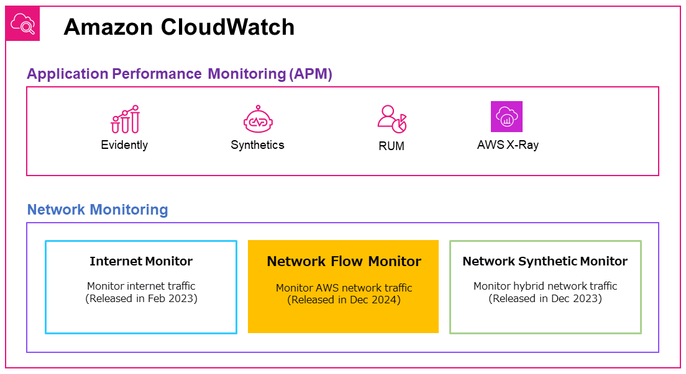

### Cách thức hoạt động

Network Flow Monitor sử dụng các **agent nhẹ** được cài đặt trên tài nguyên để thu thập chỉ số hiệu suất trực tiếp từ lưu lượng workload thực tế, phục vụ cho việc giám sát gần như theo thời gian thực.

### Các chỉ số mạng quan trọng được theo dõi:
- Dữ liệu được truyền
- Việc truyền lại (retransmissions)
- Thời gian chờ truyền lại (retransmission timeouts)
- Thời gian khứ hồi (round-trip time)

### Network Health Indicator (NHI)

Một tính năng nổi bật của flow monitor là **chỉ báo sức khỏe mạng (Network Health Indicator - NHI)**. NHI cho phép bạn xác định xem sự suy giảm mạng có phải do các vấn đề về cơ sở hạ tầng của AWS hay không. 

Khi xảy ra độ trễ mạng, chỉ báo này cực kỳ hữu ích, giúp bạn xác định nguyên nhân sự cố để có thể tập trung nỗ lực khắc phục một cách hiệu quả.

---

## Kịch bản giám sát ví dụ

Trong phần này, chúng ta sẽ xem xét một ví dụ về hai EC2 instance trong các VPC khác nhau, cùng một Region, được kết nối với AWS Transit Gateway.

### Thiết lập môi trường

Đối với ví dụ của chúng ta:
- Đã cài đặt một agent trên EC2 instance **test-instance-1** trong VPC 1 để cung cấp dữ liệu hiệu suất mạng
- Đã xây dựng một máy chủ web Apache trên EC2 instance thứ hai **test-instance-2** trong VPC 2
- Đã bật dịch vụ httpd

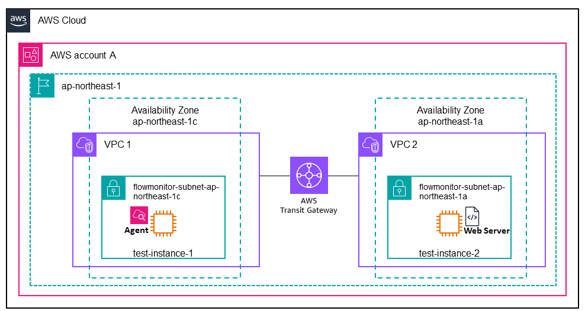

### Giám sát thụ động vs Giám sát chủ động

Không giống như các giải pháp giám sát chủ động, Network Flow Monitor cung cấp tính năng **giám sát thụ động liên tục**, phân tích lưu lượng người dùng thực tế giữa các khối lượng công việc. 

Chúng tôi đã tạo lưu lượng kiểm tra từ test-instance-1 (đã cài đặt agent) đến test-instance-2 (máy chủ web Apache).

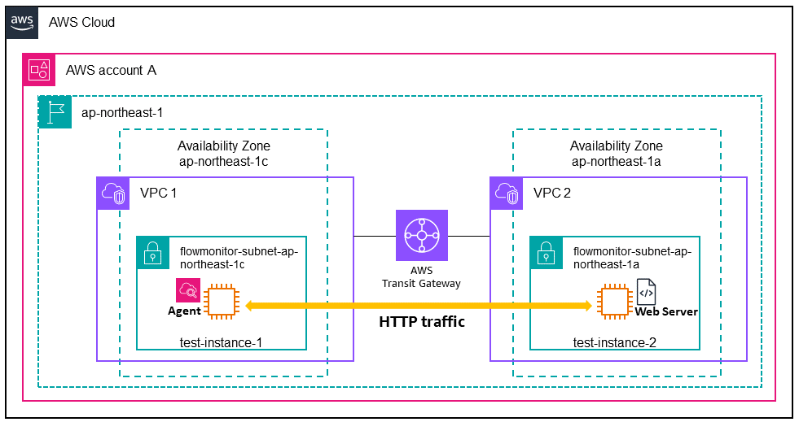

---

## Thiết lập Network Flow Monitor

Trong phần này, chúng tôi sẽ hướng dẫn thiết lập Network Flow Monitor dựa trên kịch bản ví dụ của chúng tôi. 

### Các bước thiết lập:

1. **Bật Network Flow Monitor**
2. **Cài đặt các agent Network Flow Monitor**
3. **Xem lại các luồng mạng trong Workload insights**
4. **Tạo một hoặc nhiều flow monitor**

---

### Bước 1: Bật Network Flow Monitor

Trước khi có thể sử dụng Network Flow Monitor, chúng ta phải bật các quyền cần thiết để gửi dữ liệu đến CloudWatch và ánh xạ các kết nối mạng của chúng ta. 

Khi bạn điều hướng đến Network Flow Monitor trong giao diện điều khiển lần đầu tiên, bạn sẽ được nhắc bật tính năng này.

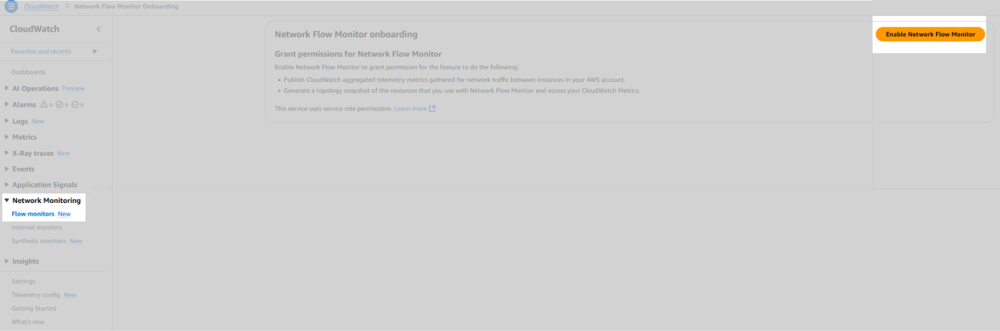

#### Quy trình bật:

Việc bật Network Flow Monitor sẽ:
- Thiết lập các quyền cần thiết
- Tạo phạm vi giám sát của bạn (hiện tại là tài khoản AWS mà bạn đã đăng nhập)

**Thời gian chờ:** Chờ một thời gian ngắn (tối đa 30 phút) trong khi Network Flow Monitor:
- Cấp quyền sử dụng các vai trò liên kết dịch vụ (service-linked roles) cần thiết với tài khoản của bạn
- Thiết lập phạm vi giám sát cho tài khoản AWS của bạn

---

### Bước 2: Cài đặt các agent Network Flow Monitor

Khi bạn cài đặt các agent trên các instance của mình, bạn cũng phải đặt quyền cho các agent để chúng có thể gửi dữ liệu đến backend của Network Flow Monitor.

#### Yêu cầu hệ thống:

Có các yêu cầu cụ thể đối với các instance Linux mà bạn có thể sử dụng trên các instance của mình, được liệt kê trong tài liệu Amazon CloudWatch.

#### Các nền tảng được hỗ trợ:

Bạn có thể cài đặt các agent trên:
- Các EC2 instance
- Các instance Kubernetes tự quản lý
- Amazon EKS

#### Cấu hình quyền:

Để bật các quyền chính xác, các EC2 instance chạy agent phải sử dụng một vai trò với chính sách **CloudWatchNetworkFlowMonitorAgentPublishPolicy**.

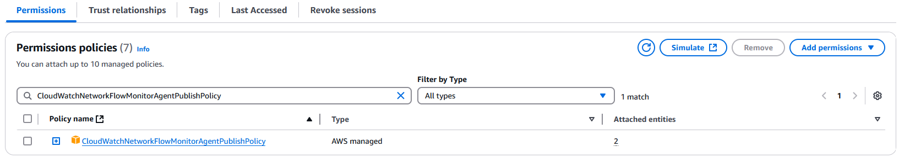

#### Cài đặt agent qua Systems Manager:

Tiếp theo, chúng tôi cài đặt các agent trong các instance. Để cài đặt các agent, chúng tôi sử dụng **AWS Systems Manager Agent**, một tính năng của AWS System Manager.

**Điều kiện tiên quyết:** Trước khi bạn bắt đầu cài đặt các agent, hãy đảm bảo rằng mỗi instance đang chạy Systems Manager Agent. Để biết thêm thông tin, hãy xem **Làm việc với Systems Manager Agent**.

#### Các bước cài đặt agent:

**1. Mở AWS Systems Manager Console**
   - Trong Console, mở bảng điều khiển AWS Systems Manager
   - Tại mục Node Tools, chọn **Distributor**

**2. Tìm gói Network Flow Monitor**
   - Tại mục Owned by Amazon, tìm gói: **AmazonCloudWatchNetworkFlowMonitorAgent**
   - Chọn gói, sau đó chọn **Install one time** hoặc **Install on schedule**

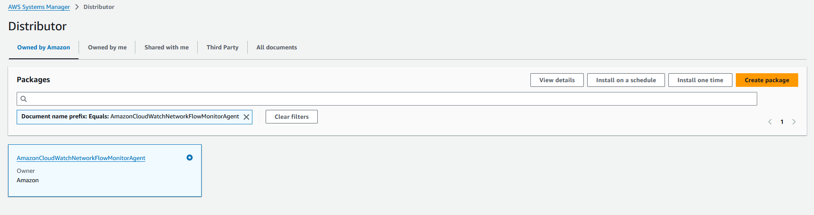

**3. Chọn các EC2 instance**
   - Chọn các EC2 instance để cài đặt các agent
   - Đối với ví dụ của chúng tôi, chúng tôi chỉ chọn **test-instance-1**

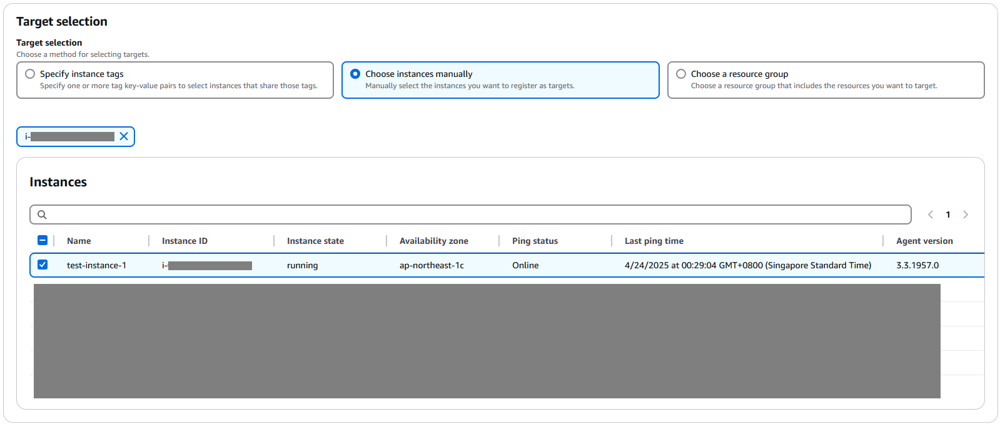

**4. Chạy cài đặt**
   - Cuối cùng, chọn **Run** để bắt đầu cài đặt agent

Sau khi cài đặt hoàn tất thành công, bạn sẽ thấy thông báo trạng thái lệnh.

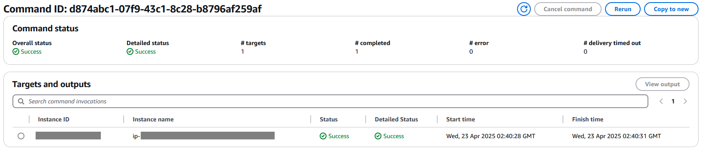

---

### Bước 3: Xem lại các luồng mạng trong Workload insights

Sau khi bạn bật Network Flow Monitor và cài đặt các agent, bạn có thể xem lại dữ liệu hiệu suất luồng mạng trong giao diện điều khiển. 

#### Truy cập Workload insights:

1. Trong bảng điều khiển CloudWatch, dưới **Network Monitoring**, chọn **Flow monitors**
2. Trên tab **Workload insights**, bạn có thể xem lại các luồng mạng đóng góp hàng đầu
3. Bạn có thể xác định luồng nào bạn muốn giám sát chi tiết hơn

Để biết thêm chi tiết, hãy xem **Đánh giá các luồng mạng bằng thông tin chi tiết về khối lượng công việc**.

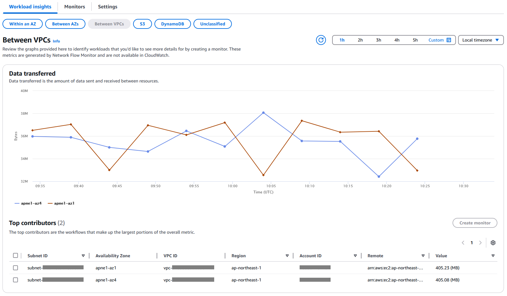

#### Tạo monitor từ Top contributors:

Để tìm hiểu sâu hơn về các luồng mạng cụ thể, bạn có thể tạo một monitor theo một trong hai cách:

**Cách 1:** Chọn các luồng mạng trong **Top contributors**, sau đó chọn **Create monitor**

**Cách 2:** Chọn **Create monitor**, và sau đó chỉ định các tài nguyên cục bộ và từ xa riêng lẻ để giám sát các luồng mạng giữa chúng (như được mô tả trong Bước 4)

---

### Bước 4: Tạo một flow monitor

Để bắt đầu tạo một monitor, trong bảng điều khiển Network Flow Monitor, chọn **Create monitor**.

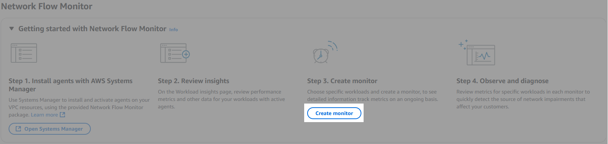

#### Các bước tạo monitor:

**1. Đặt tên cho Monitor**

Đối với **Monitor name**, chúng tôi chọn: `monitor-ap-northeast-1c-1a`

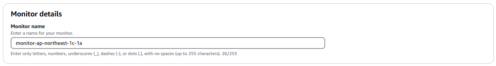

**2. Chọn Local resources (Tài nguyên cục bộ)**

Chỉ định các loại luồng mạng mà bạn muốn giám sát, sau đó chọn các tùy chọn cụ thể cho từng loại.

**Các loại tài nguyên cục bộ được hỗ trợ:**
- Subnet
- VPC
- Availability Zone

Đối với ví dụ của chúng tôi, chúng tôi chọn subnet nơi instance cư trú: `flowmonitor-subnet-ap-northeast-1c`

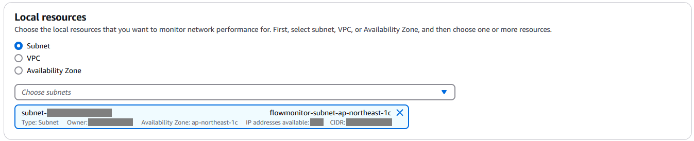

**3. Chọn Remote resources (Tài nguyên từ xa)**

Bạn có hai tùy chọn:

**Option A: Everywhere (Mọi nơi)**
- Monitor bao gồm tất cả các luồng mạng bắt nguồn từ các tài nguyên cục bộ đã chọn

**Option B: Select remote resources (Chọn tài nguyên từ xa)**
- Bạn có thể chọn các tài nguyên từ xa cụ thể để giám sát
- Có thể chọn một hoặc nhiều tài nguyên trong:
  - Subnets
  - VPCs
  - Availability Zones (AZs)
  - Các dịch vụ AWS (Amazon S3, DynamoDB, v.v.)

Đối với ví dụ của chúng tôi, chúng tôi chỉ định một subnet làm tài nguyên từ xa lưu trữ máy chủ web: `flowmonitor-subnet-ap-northeast-1a`

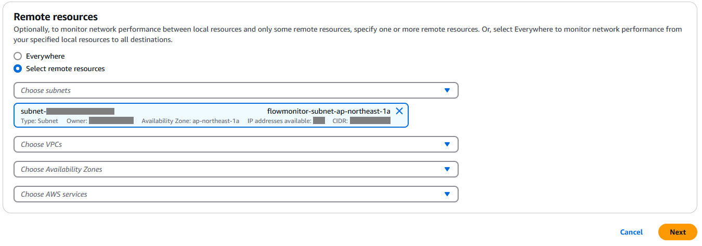

**4. Hoàn tất tạo monitor**

- Chọn **Next** (Tiếp theo), và sau đó xem lại cấu hình cho monitor
- Chọn **Create monitor** (Tạo monitor)

**Thời gian chờ:** Sau khi bạn tạo monitor, hãy đợi tối đa 30 phút để Network Flow Monitor bắt đầu thu thập và tổng hợp dữ liệu.

---

## Trực quan hóa các chỉ số Network Flow Monitor

Sau khi bạn tạo một monitor, Network Flow Monitor bắt đầu công bố:
- Các chỉ số hiệu suất đầu cuối (end-to-end)
- Một chỉ báo sức khỏe mạng cho các vấn đề suy giảm mạng

### Nơi xem các chỉ số:

Bạn có thể trực quan hóa thông tin cho một monitor ở hai nơi:

**1. Bảng điều khiển Network Flow Monitor**

**2. Các chỉ số CloudWatch**
- Dưới không gian tên tùy chỉnh: `AWS/NetworkFlowMonitor`

### Xem dữ liệu hiệu suất trong Console:

Đối với ví dụ của chúng tôi, chúng tôi xem trong bảng điều khiển Network Flow Monitor để xem dữ liệu hiệu suất cho monitor của chúng tôi.

1. Trên tab **Monitors**, chọn monitor: `monitor-ap-northeast-1c-1a`

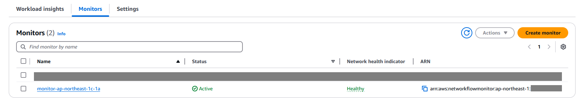

2. Để có cái nhìn tổng thể về các luồng mạng cho monitor, kiểm tra tab **Overview**

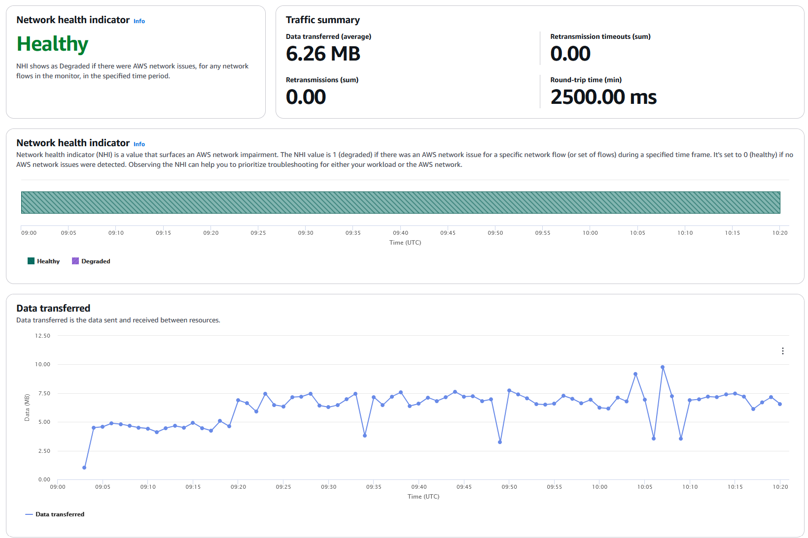

### Historical Explorer:

Tiếp theo, đi tới tab **Historical explorer** để xem các chỉ số chi tiết hơn cho các luồng mạng được giám sát.

#### Tính năng Topology (Tô-pô):

Khi có sự suy giảm hiệu suất, tính năng tô-pô sẽ hiển thị:
- Tất cả các thành phần trong đường dẫn mạng
- Các biểu tượng dịch vụ và ID tài nguyên

Hình ảnh trực quan hóa này giúp bạn xác định:
- Các nguồn đóng góp hàng đầu cho từng chỉ số hiệu suất
- Các cặp nguồn-đích (bucket pairs) trong khung thời gian đã chỉ định để thực hiện hành động phục hồi

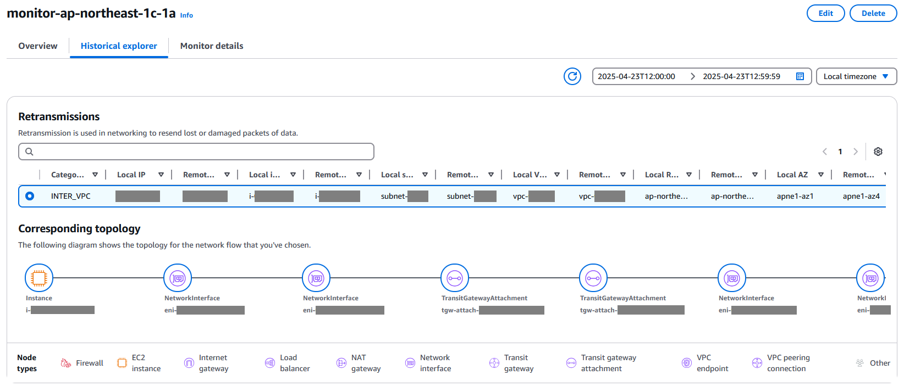

---

## Dọn dẹp tài nguyên

Sau khi kết thúc đánh giá Network Flow Monitor của bạn, hãy nhanh chóng xóa tất cả các monitor kiểm thử và các tài nguyên tạm thời. 

---

## Kết luận

Trong bài đăng này, chúng tôi đã giới thiệu **Network Flow Monitor**, một tính năng quan sát mới của Amazon CloudWatch Network Monitoring, cung cấp khả năng hiển thị gần như thời gian thực về hiệu suất mạng cho các workload giữa các compute instance và các dịch vụ AWS.

### Lợi ích chính:

Sử dụng phạm vi các chỉ số và thông tin mà các flow monitor cung cấp, bạn có thể:
- Nhanh chóng phân tích và hành động đối với sự suy giảm hiệu suất mạng
- Giảm thiểu thời gian khắc phục sự cố cho các khối lượng công việc đám mây của mình
- Cải thiện MTTD và MTTR

---

## Tìm hiểu thêm về Network Flow Monitor

Bây giờ chúng tôi đã chia sẻ tổng quan về các lợi ích của Network Flow Monitor, hãy kiểm tra thông tin bổ sung sau để biết chi tiết:

### Tài nguyên hữu ích:

**1. Giá cả**
- Để tìm hiểu thêm về giá cả, hãy truy cập [trang định giá CloudWatch](https://aws.amazon.com/cloudwatch/pricing/)

**2. Tính khả dụng theo khu vực**
- Flow Monitor hiện có sẵn ở **17 Khu vực AWS**
- Để có danh sách đầy đủ, hãy xem tài liệu

**3. Tài liệu kỹ thuật**
- Để biết chi tiết và hướng dẫn kỹ thuật về Network Flow Monitor, hãy xem [tài liệu kỹ thuật](https://docs.aws.amazon.com/AmazonCloudWatch/latest/monitoring/CloudWatch-Network-Flow-Monitor.html)

---

## Về các tác giả

### Hiroki Fujii

**Hiroki** là Giám đốc Tài khoản Kỹ thuật Cấp cao làm việc tại Singapore. Anh có hơn 10 năm kinh nghiệm trong việc thiết kế, xây dựng và vận hành các mạng tại chỗ, bao gồm:
- Các trung tâm dữ liệu
- Mạng khuôn viên
- Mạng xương sống

Ngoài công việc, anh ấy thích tập thể dục, chơi gôn và khám phá các quốc gia và nền văn hóa mới cùng gia đình tuyệt vời của mình.

### Vishwas Puttasubbappa

**Vishwas** là Giám đốc Sản phẩm Kỹ thuật Chính (Principal Product Manager Technical) trong bộ phận Mạng AWS. Anh ấy đã làm việc trong lĩnh vực mạng trong 20 năm qua, thiết kế và xây dựng mạng lưới và các sản phẩm mạng. 

Ngoài công việc, anh ấy thích dành phần lớn thời gian cho gia đình mình.

---