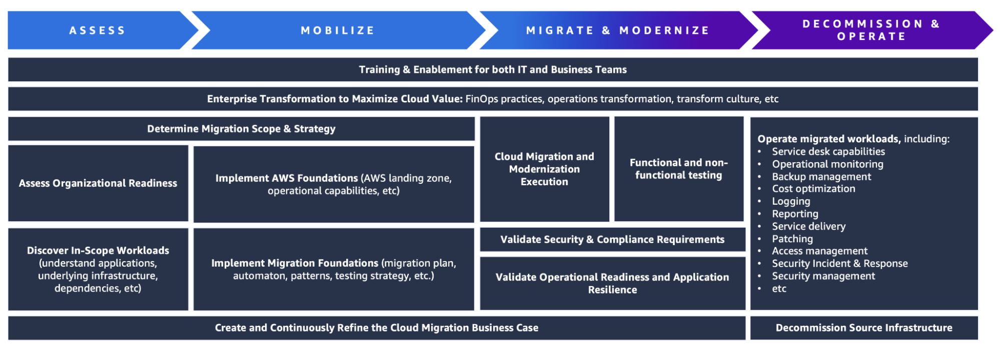

# Smooth Data Center Migration: Understanding the Complete Journey

**Authors:** Damien Renner and Matt Collins  
**Published:** July 2, 2025  
**Categories:** AWS Transform, Best Practices, Customer Solutions, Enterprise Strategy, Experience-Based Acceleration, Migration, Migration & Transfer Services, Migration Portfolio Assessment, Self-serve Migration

## Introduction

Data center migration is a transformative undertaking that impacts every aspect of an organization's IT infrastructure, operations, and potentially its entire business model. Unlike traditional technology upgrades, cloud migration represents fundamental changes in how organizations approach computing, storage, security, and technology innovation. To maximize cloud value while minimizing disruption, a comprehensive approach is needed that includes empowering teams, implementing business processes, validating operational capabilities, and more. Focusing on the entire journey and treating the project as a large-scale digital transformation initiative is critical to ensuring successful, sustainable, and strategic cloud adoption that delivers tangible business value.

In this blog post, we will outline a typical data center migration journey based on our experience supporting thousands of enterprise customers, leveraging AWS's migration methodology framework. As you read this post, we recommend comparing your migration project against each component. This will indicate the overall status of your project and help identify areas that need focus.

## Typical Data Center to Cloud Migration Journey

### Training & Enablement

Training and enabling your IT and business teams is a critical component of cloud migration projects. While AWS Transform eliminates the need to invest countless hours upskilling your team to become migration experts as it serves as your trusted virtual advisor, it's important to ensure your team has sufficient AWS knowledge and experience to effectively operate migrated workloads and maximize cloud value. We recommend being proactive and intentional about training your team as this is a critical step that can take months to implement. AWS Learning Needs Analysis is a great starting point that will survey your employees about their cloud skills and identify necessary areas with a customized learning plan.

### Enterprise Transformation

To maximize cloud value, you may need to transform your organization and ways of working. For example, aligning cloud strategy with strategic priorities, achieving consensus among IT and Business stakeholders, updating your operating model to align with cloud best practices, building a digital culture throughout the organization, and implementing Cloud FinOps best practices. It's important to be intentional and proactive about these factors to maximize long-term cloud value.

### Define Scope & Migration Strategy

Defining the scope of your migration project is critical to facilitate all subsequent phases. While this is fairly straightforward for some customers who migrate all assets in their data center, other customers often use the migration project as an opportunity to rationalize their application portfolio, which requires deeper analysis. To support this, we recommend leveraging our 7R migration strategies.

### Assess Organizational Readiness

Assessing organizational readiness in the early stages of a migration project allows you to create a targeted plan for components that typically take longer to implement. We recommend discussing the Migration Readiness Assessment (MRA) program with your AWS Partner or Account Manager to identify strengths and weaknesses from a cloud readiness perspective, and build an action plan to address any identified gaps.

### Discover In-Scope Workloads

Customers often don't have clear understanding of every workload in their data center, the underlying infrastructure for each workload (servers, databases, shared storage, load balancers, etc.), the dependencies a workload has across the system, and licensing requirements. In this scenario, you may need to perform a discovery phase to ensure your migration team has the necessary data. Executing this phase correctly can significantly accelerate your migration velocity in later phases, and AWS Transform Assessments can simplify this step by analyzing your IT environment to provide data-driven insights and actionable recommendations.

### Build Business Case for Migration

The value of cloud extends beyond reducing Total Cost of Ownership (TCO). AWS customers also see significant improvements in other areas, including staff productivity, operational resilience, and business agility. The migration business case phase helps align stakeholders across the organization and is a great opportunity to reassess the alignment of the proposed migration strategy with organizational goals. We recommend reading the Business Value on AWS guide and leveraging AWS Transform for detailed financial modeling of your workloads to maximize cost savings.

### Deploy AWS Foundation

Before you can migrate workloads to the cloud, you'll need to deploy your AWS foundation. This includes creating a well-architected AWS Landing Zone, establishing network connectivity, and building common services that your applications require. The Landing Zone Accelerator on AWS solution deploys a set of foundational capabilities designed to align with AWS best practices and multiple global compliance frameworks. With this AWS Solution, you can better manage and govern your multi-account environment that has tightly managed workloads and complex compliance requirements.

### Deploy Migration Foundation

Deploying a robust migration foundation such as migration plans, migration patterns, and migration automation is critical when transforming your data center to AWS and allows your project to scale efficiently and structurally. These components outline which workloads will be migrated, when, and how they will be migrated. AWS Transform removes guesswork from cloud migration decisions with actionable insights that guide your migration strategy and help you confidently plan migrations based on your in-scope workloads.

### Execute Migration & Modernization

This is the phase where all previous aspects are put to the test, leveraging the patterns and automation created in the previous step. Don't hesitate to revisit previous components if challenges are discovered (e.g., additional discovery activities if you don't have enough data to migrate pilot workloads or reassess training approach if skill gaps are identified). We recommend starting with AWS Experience-Based Accelerator (EBA) to build momentum and using AWS Transform to leverage AI agents to automate complex tasks (such as creating infrastructure as code, analyzing application code, decomposition, refactoring, validation, and deployment).

### Functional & Non-Functional Testing

While functional and non-functional testing of a workload is typically required before formal production cutovers, the volume of servers being migrated can pose project-level challenges. Consider creating a comprehensive testing strategy as early as possible, outlining priorities, scenarios to test, and where to apply. For example, apply higher priority to business-critical workloads and a 'fix-forward' approach for non-critical workloads to balance business continuity and migration velocity.

### Validate Security & Compliance Requirements

Security and compliance are not checkboxes but strategic imperatives for all businesses. Validating that security requirements are met is a critical component in all cloud adoption journeys. If you haven't already, we recommend checking out AWS Security Hub to centralize your security checks and alerts, and evaluating your internal governance program as it transitions from on-premises environments to the cloud with the AWS Shared Responsibility Model. If you have compliance requirements such as PCI DSS or HIPAA, AWS Security Assurance Services (AWS SAS) provides access to experienced auditors combined with AWS technical depth to support your compliance requirements.

### Validate Application Resilience & Operational Readiness

Your data center may contain mission-critical workloads that must be designed with high-availability. When migrating these workloads, we recommend conducting Well-Architected Framework reviews to validate workload implementation, and application resilience assessments to validate whether technology, people, and process aspects align with your recovery objectives. This may include conducting simulated game-days where end-to-end scenarios are tested (monitoring, alerting, response, remediation, etc.).

### Operate Migrated Workloads

Each migrated workload need We recommend planning ahead for this phase and creating a migration plan that allows your team to gradually build experience, such as starting with low-priority, low-complexity workloads. Additionally, AWS Managed Services (AMS) can provide temporary operational support to allow accelerated migration progress and free your team from daily cloud operations, such as monitoring, incident and problem management, patching, backup, and security management.

### Decommission Source Infrastructure

Many business cases depend on decommissioning source infrastructure, but you'd be surprised how many customers don't proactively plan for this phase of the project. We recommend ensuring your migration plan aligns with data center decommissioning/disposal requirements and implementing an effective handoff process from the migration team to the decommissioning team to simplify this phase.

## Conclusion

This blog post has provided an overview of the typical customer journey when migrating a data center to the cloud. By understanding each component of the migration journey, you can better minimize disruption and maximize the strategic value of your cloud transformation.

We recommend evaluating your data center migration project based on the components outlined in this blog and sharing these findings with your AWS Account Manager to receive recommendations based on our experience migrating thousands of enterprise customers to the cloud.

---

### About the Authors

**Damien Renner**

As a Senior Technical Product Manager at AWS, Damien Renner helps large enterprises navigate complex digital transformation initiatives and cloud adoption. He is an expert in data center migration and supports customers across various industries. In his free time, Damien enjoys mountain climbing or planning his next travel adventure.

**Matt Collins**

As a Leader of AWS Global Services Offerings, Matt Collins helps organizations worldwide transform their businesses through AI and cloud technology. A passionate technologist with over 35 years of experience in Software Development, IT strategy, and Innovation, he has guided some of the world's largest enterprises through their digital evolution. When not busy shaping the future of AI and cloud services, Matt spends time mentoring young tech talent and exploring breakthrough technologies.

---
