#  AI-Driven Development Life Cycle – Reimagining Software Engineering

## 🗓 Thông Tin Sự Kiện

- **Thời gian:** 14:00 – 16:30, Thứ Sáu ngày 3 tháng 10 năm 2025
- **Địa điểm:** Tầng 26, Tòa nhà Bitexco Financial Tower, số 2 đường Hải Triều, phường Bến Nghé, Quận 1, Thành phố Hồ Chí Minh

## 👨‍🏫 Diễn Giả

- **Toàn Huỳnh** – Specialist Solutions Architect, PACE
- **My Nguyễn** – Senior Prototyping Architect, Amazon Web Services – ASEAN

## 🎯 Chủ Đề Chính

Ứng dụng AI vào toàn bộ vòng đời phát triển phần mềm với Amazon Q Developer và Kiro

## 🔍 Tổng Quan Sự Kiện

Sự kiện lần này của AWS GenAI Builder Club đã mang đến một góc nhìn mới mẻ và thực tiễn về cách AI đang tái định hình quy trình phát triển phần mềm. Với sự góp mặt của hai công cụ tiên tiến – Amazon Q Developer và Kiro, người tham dự đã được chứng kiến cách AI có thể hỗ trợ từ giai đoạn lên ý tưởng đến triển khai sản phẩm.

## 🧠 Nội Dung Chuyên Sâu Từ Các Phiên Trình Bày

### 1. AI-Driven Development Lifecycle (AI-DDLC)

Diễn giả Toan Huynh đã trình bày về mô hình AI-DDLC, trong đó AI đóng vai trò điều phối toàn bộ quy trình phát triển phần mềm: từ lập kế hoạch, phân rã nhiệm vụ, đề xuất kiến trúc hệ thống đến triển khai. Tuy nhiên, developer vẫn giữ vai trò kiểm duyệt và ra quyết định cuối cùng, đảm bảo tính chính xác và phù hợp với mục tiêu kinh doanh.

### 2. Kiro – AI IDE từ prototype đến production

Diễn giả My Nguyen đã giới thiệu Kiro – một môi trường phát triển tích hợp AI (AI IDE) giúp chuyển đổi prompt thành kết quả rõ ràng, thiết kế hệ thống và triển khai. Với triết lý spec-driven development, Kiro mang lại cấu trúc rõ ràng cho quá trình lập trình AI, giúp lập trình viên kiểm soát toàn bộ vòng đời phát triển.

### 3. Agent Hooks – Tự động hóa thông minh

Một điểm nổi bật là khả năng thiết lập agent hooks – các tác vụ AI tự động được kích hoạt theo sự kiện như "file save". Các agent này có thể tự động tạo tài liệu, viết unit test hoặc tối ưu hiệu năng mã nguồn, giúp mở rộng quy mô công việc mà không cần can thiệp thủ công.

### 4. Maximize Semantics per Token – Tối ưu hóa đầu vào cho AI

Thay vì đưa vào hàng ngàn dòng mã, Kiro khuyến khích sử dụng các mô hình trung gian giàu ngữ nghĩa như user stories hoặc sơ đồ thành phần. Điều này giúp AI hiểu rõ hơn và phản hồi chính xác hơn, tránh lãng phí token và tài nguyên xử lý.

### 5. Anti-Patterns – Những sai lầm cần tránh khi dùng AI

Buổi chia sẻ cũng chỉ ra các anti-patterns phổ biến như:

- Dùng AI một lần cho vấn đề nhiều bước
- Không làm mới ngữ cảnh thường xuyên
- Để AI vượt quá phạm vi kiểm soát
- Thiếu cấu trúc khi làm việc với hệ thống cũ (brownfield)

### 6. Kiến trúc hệ thống và phân nhóm user stories

Người tham dự được hướng dẫn cách nhóm các user stories thành các đơn vị chức năng như User Management Service, Booking Service, v.v. Mỗi đơn vị đều có mô tả nhiệm vụ, tiêu chí chấp nhận và các yêu cầu phi chức năng rõ ràng – giúp tăng tính dự đoán, cải thiện chất lượng và tăng tốc độ phản hồi thị trường.

### 7. Lộ trình phát triển AI trong phần mềm (2020–2024)

Một slide đáng chú ý đã mô tả sự tiến hóa của AI trong phát triển phần mềm:

- **2020:** Tự động hoàn thành mã
- **2022:** Trợ lý AI hỗ trợ viết đoạn mã lớn và trả lời câu hỏi
- **2024:** Agent AI có thể hoàn thành toàn bộ tác vụ phát triển với con người trong vòng kiểm soát

## 🎯 Kết Quả Và Tác Động

Buổi chia sẻ đã giúp người tham dự:

- Hiểu rõ cách AI có thể tăng tốc độ phát triển, từ ý tưởng đến sản phẩm
- Nâng cao chất lượng phần mềm và sự hài lòng của khách hàng
- Tạo ra môi trường làm việc hấp dẫn, giúp lập trình viên tập trung vào sáng tạo
- Thúc đẩy cải tiến liên tục trong quy trình phát triển phần mềm

Kiro được đánh giá là một bước tiến quan trọng trong việc đưa AI vào vai trò cộng tác viên thực thụ – không chỉ hỗ trợ mà còn hiểu ngữ cảnh, phân tích kiến trúc và đưa ra đề xuất có giá trị.

## ✍️ Nhận Xét Cá Nhân

Tham dự buổi chia sẻ "AI-Driven Development Life Cycle" là một trải nghiệm cực kỳ giá trị đối với tôi. Điều khiến tôi ấn tượng nhất là cách Kiro được thiết kế để không chỉ hỗ trợ mà còn hiểu rõ ngữ cảnh phát triển phần mềm – từ việc phân tích user stories, nhóm chúng thành các đơn vị chức năng, đến việc đề xuất kiến trúc hệ thống và triển khai theo chuẩn spec-driven.

Tôi đặc biệt thích triết lý "AI là cộng tác viên" – nơi AI không thay thế con người mà đóng vai trò hỗ trợ thông minh, giúp tôi tập trung vào những phần sáng tạo và chiến lược hơn. Việc sử dụng agent hooks để tự động hóa các tác vụ như viết tài liệu hay kiểm thử cũng mở ra tiềm năng rất lớn trong việc tối ưu hóa quy trình làm việc hàng ngày.

Buổi trình bày của anh Toan Huynh và chị My Nguyen rất rõ ràng, thực tế và truyền cảm hứng. Tôi mong muốn được ứng dụng Kiro vào các dự án sắp tới, đặc biệt là những hệ thống có kiến trúc phức tạp hoặc yêu cầu phân tích sâu về nghiệp vụ.

Nếu có thể, tôi hy vọng các buổi sau sẽ đi sâu hơn vào phần tích hợp Kiro với các công cụ CI/CD và quản lý dự án như Jira hay GitHub – để thấy rõ hơn cách AI có thể đồng hành xuyên suốt vòng đời phát triển phần mềm.

## 🎓 Những Gì Học Được Từ Sự Kiện

### 1. Tư duy phát triển phần mềm hiện đại với AI

AI không chỉ là công cụ hỗ trợ mà còn đóng vai trò điều phối toàn bộ vòng đời phát triển phần mềm. Việc phân rã nhiệm vụ, đề xuất kiến trúc, và tự động hóa kiểm thử đều có thể được AI đảm nhận, giúp developer tập trung vào các quyết định chiến lược.

### 2. Kiro – AI IDE định hình tương lai phát triển ứng dụng

Kiro mang đến một cách tiếp cận mới: spec-driven development. Thay vì viết mã từ đầu, developer có thể bắt đầu từ yêu cầu nghiệp vụ, để AI tự động hóa phần triển khai. Điều này giúp tăng tốc độ phát triển, giảm sai sót và đảm bảo tính nhất quán trong kiến trúc hệ thống.

### 3. Tối ưu hóa đầu vào cho AI bằng ngữ nghĩa

Một bài học quan trọng là: AI không "suy nghĩ bằng mã" mà suy luận bằng ý nghĩa. Việc cung cấp đầu vào giàu ngữ nghĩa như user stories, sơ đồ thành phần, hay mô hình nghiệp vụ sẽ giúp AI phản hồi chính xác hơn và tiết kiệm tài nguyên xử lý.

### 4. Tránh các anti-patterns khi làm việc với AI

Các sai lầm phổ biến như xử lý vấn đề đa bước bằng một lần gọi AI, không làm mới ngữ cảnh, hoặc để AI vượt quá phạm vi kiểm soát đều có thể dẫn đến kết quả không mong muốn. Việc hiểu rõ các anti-patterns giúp developer sử dụng AI hiệu quả hơn.

### 5. Tự động hóa thông minh với Agent Hooks

Khả năng thiết lập các agent tự động kích hoạt theo sự kiện như "file save" giúp mở rộng quy mô công việc mà không cần can thiệp thủ công. Đây là một bước tiến lớn trong việc tích hợp AI vào quy trình DevOps.

### 6. Lộ trình tiến hóa của AI trong phát triển phần mềm

Từ auto-complete (2020) đến assistants (2022) và agents (2024), AI đang dần đảm nhận các vai trò phức tạp hơn, tiến tới khả năng hoàn thành toàn bộ tác vụ phát triển với con người trong vòng kiểm soát.

## 🧭 Bài Học Rút Ra

- **AI không thay thế con người, mà nâng cao năng lực của con người.** Việc giữ vai trò kiểm duyệt và ra quyết định cuối cùng là yếu tố then chốt để đảm bảo chất lượng và đạo đức trong phát triển phần mềm.

- **Cấu trúc và ngữ nghĩa là chìa khóa để AI hoạt động hiệu quả.** Việc cung cấp thông tin rõ ràng, có tổ chức giúp AI hiểu đúng và phản hồi chính xác.

- **Tư duy kiến trúc phần mềm cần thích nghi với AI.** Việc nhóm user stories thành các đơn vị chức năng, xây dựng mô hình thành phần và triển khai theo spec là cách tiếp cận phù hợp với môi trường AI hỗ trợ.

- **Tự động hóa không chỉ là tiết kiệm thời gian, mà còn là nâng cao chất lượng.** Các agent hooks giúp đảm bảo tài liệu, kiểm thử và tối ưu hóa luôn được cập nhật kịp thời.

## 📸 Một Số Hình Ảnh Khi Tham Gia Sự Kiện

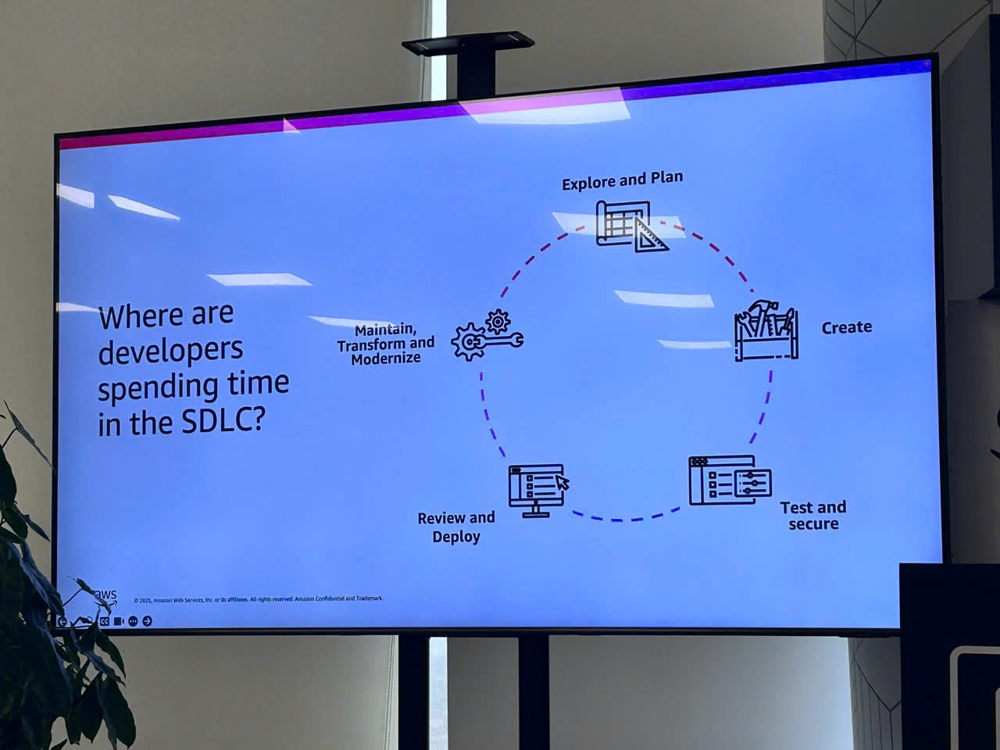

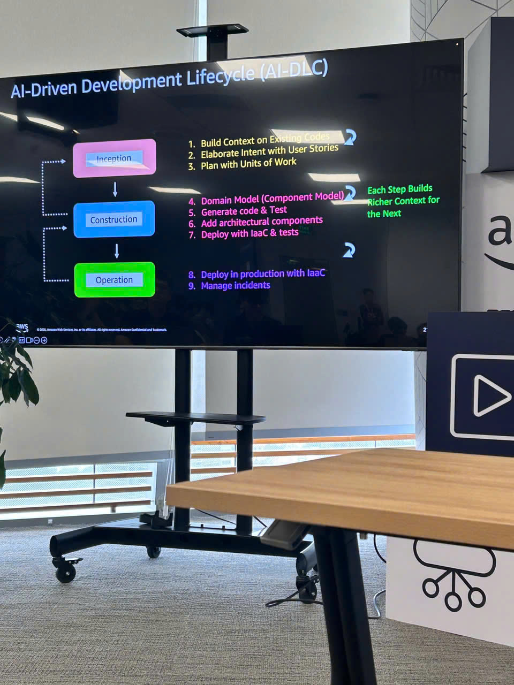

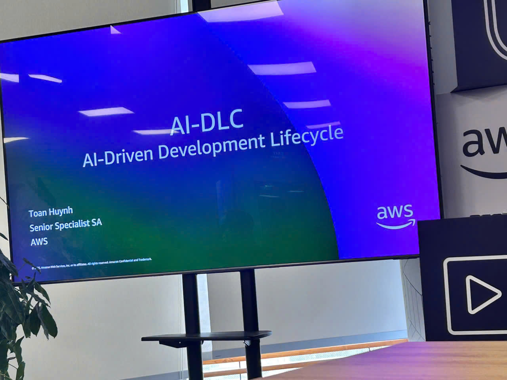

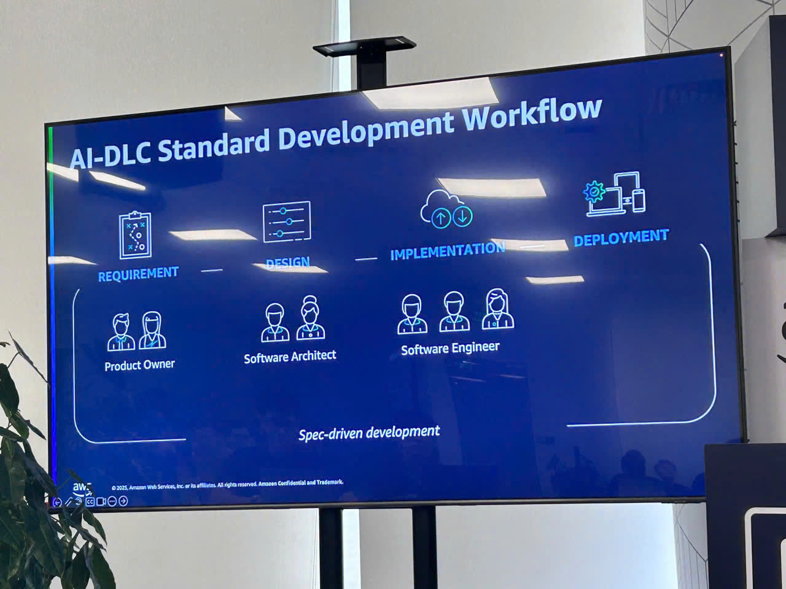

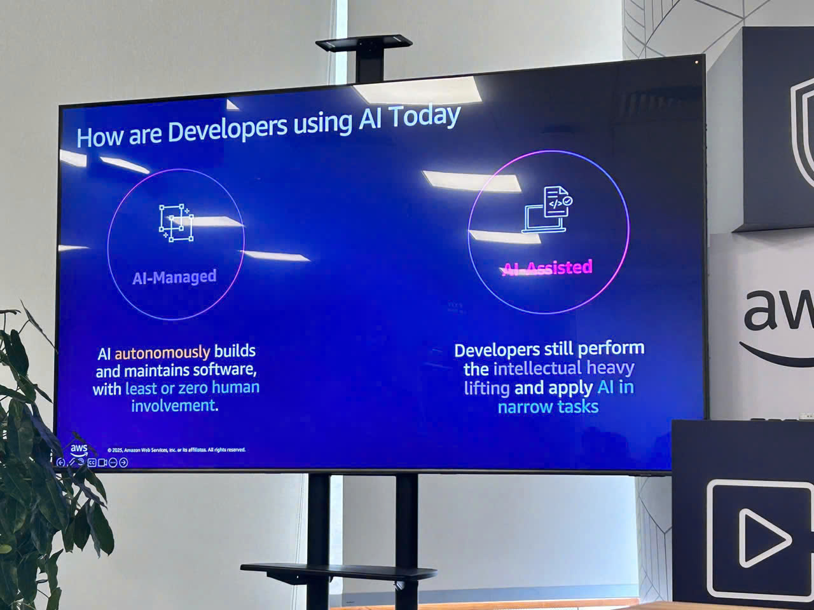

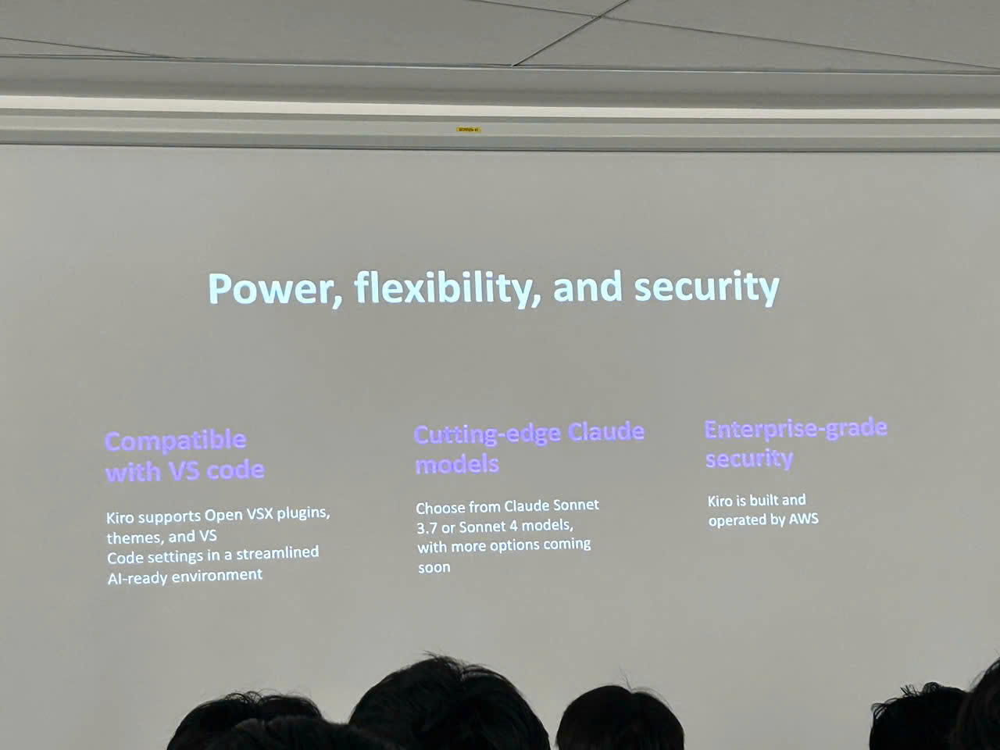

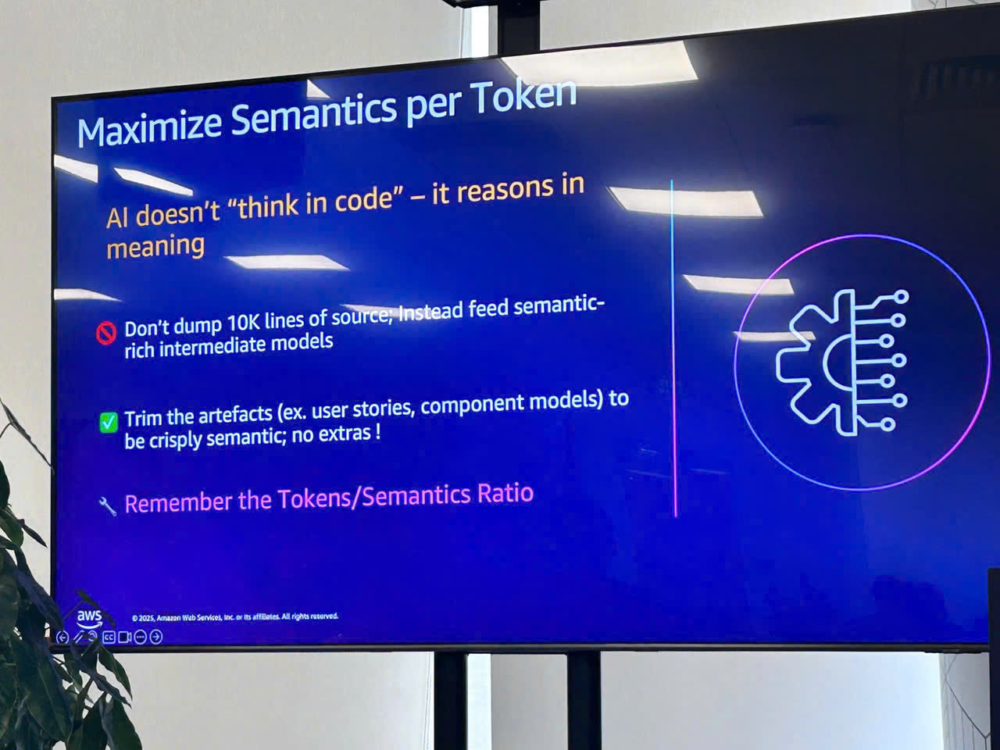

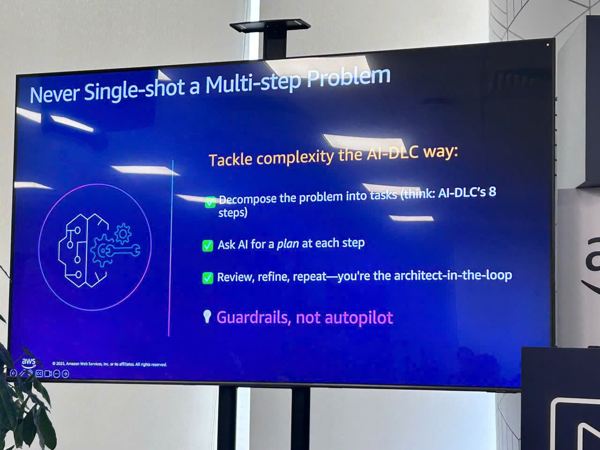

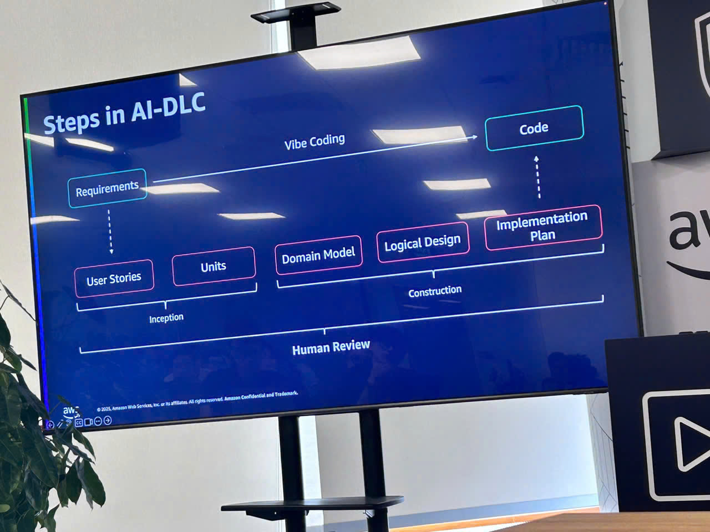

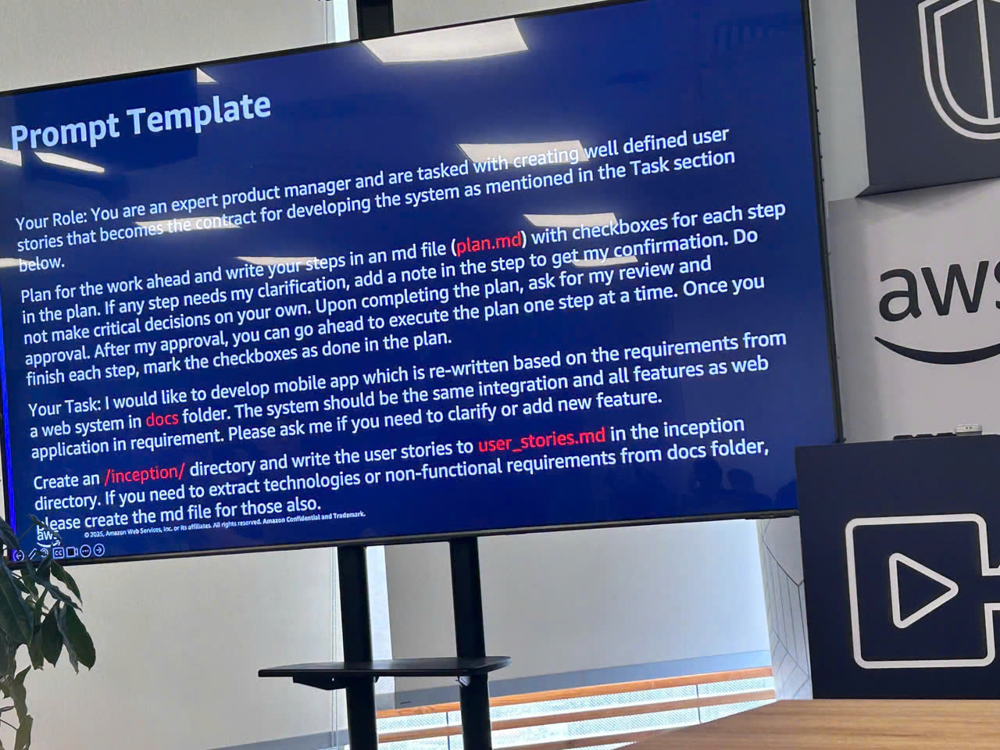

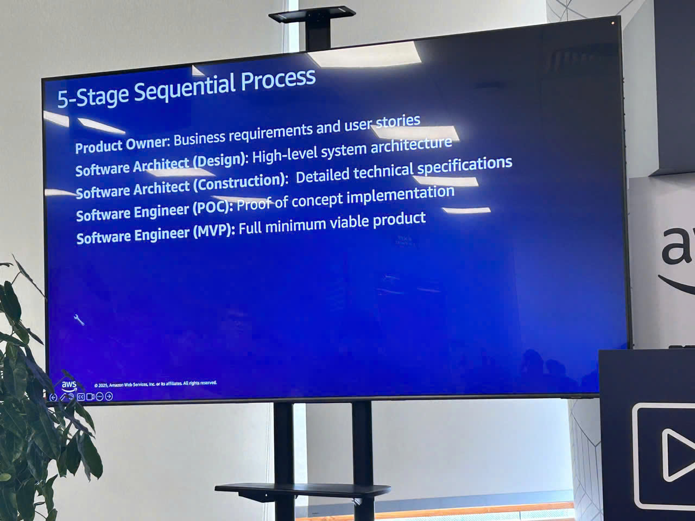

