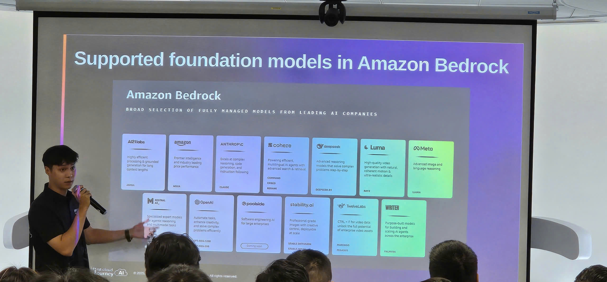
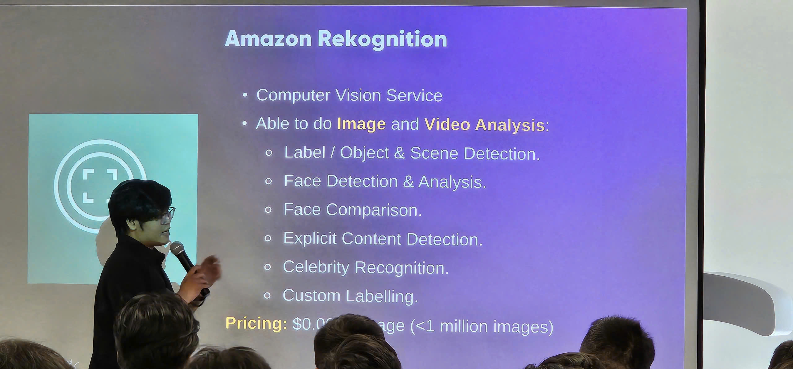
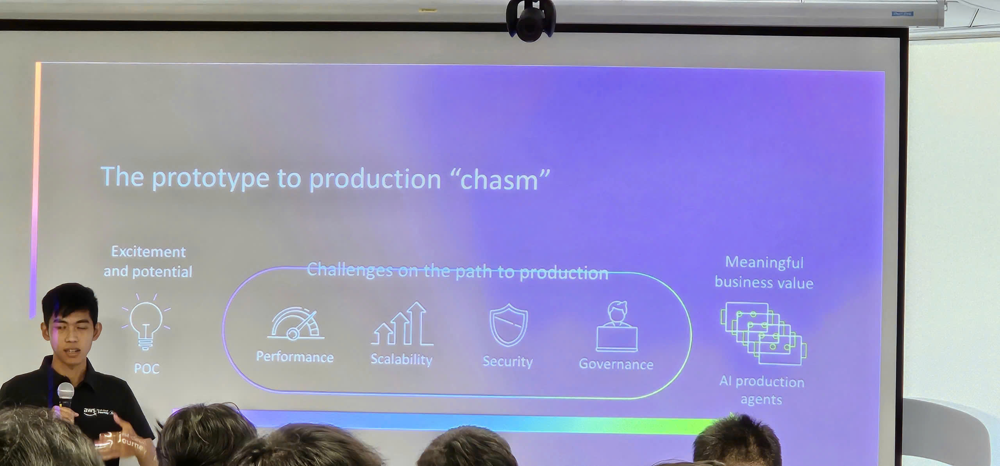
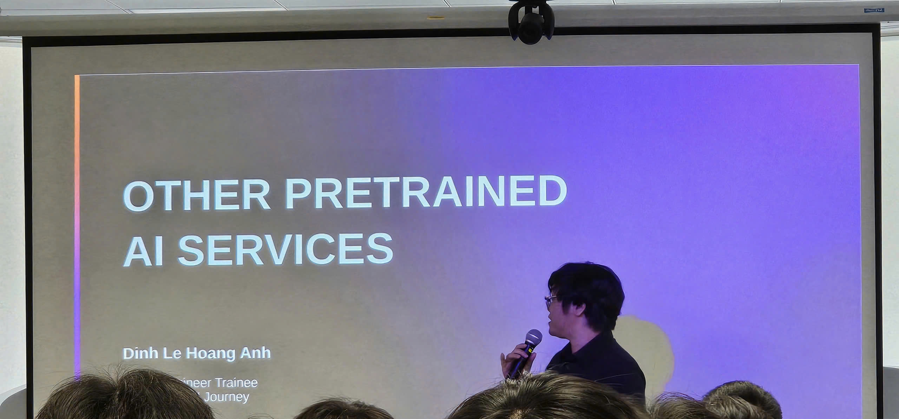

# 🤖 Workshop AI/ML/GenAI trên AWS

### 🎯 Mục Đích Workshop

- Tìm hiểu thực trạng và xu hướng AI/ML cùng các dịch vụ AWS đang được ứng dụng tại thị trường Việt Nam
- Thực hành quy trình machine learning toàn diện thông qua nền tảng Amazon SageMaker
- Trải nghiệm công nghệ Generative AI tiên tiến với Amazon Bedrock
- Rèn luyện kỹ năng prompt engineering và phương pháp RAG (Retrieval-Augmented Generation)
- Phát triển các ứng dụng AI/ML có tính ứng dụng cao bằng công nghệ AWS

### 📍 Thông Tin Sự Kiện

- **Địa điểm**: Tầng 26, Tòa nhà Bitexco Financial Tower, số 2 đường Hải Triều, phường Bến Nghé, Quận 1, Thành phố Hồ Chí Minh
- **Ngày & Giờ**: 8:30 sáng – 12:00 trưa, Thứ Bảy, ngày 15 tháng 11 năm 2025

### 👨‍🏫 Diễn Giả & Điều Phối Viên

**Giảng viên:**

- **Lâm Tuấn Kiệt** – Senior DevOps Engineer, FPT Software – Tổng quan Amazon SageMaker và ML Services
- **Đinh Lê Hoàng Anh** – Cloud Engineer Trainee, FCAJ Đại học Kỹ thuật Swinburne – Amazon Bedrock và các dịch vụ AWS AI/ML 
- **Danh Hoàng Hiếu Nghị** – Fresher AI Engineer, Renova Cloud – Amazon Bedrock Agent Core, trình diễn trực tiếp và hướng dẫn thực hành

**Điều phối viên:**

- **AWS Vietnam Community Team**
- **FCJ Program Leaders**

### 📋 Nội Dung Chương Trình

#### ⏰ 8:30 – 9:00 sáng: Khai Mạc & Làm Quen

- Check-in và networking giữa các thành viên
- Giới thiệu tổng quan về workshop cùng kỳ vọng đạt được
- Hoạt động làm quen và tạo không khí thân thiện
- Bức tranh tổng thể về AI/ML trong bối cảnh Việt Nam hiện nay

#### ⏰ 9:00 – 10:30 sáng: Khám Phá Hệ Sinh Thái AWS AI/ML

**🔬 Amazon SageMaker – Giải Pháp ML Toàn Diện**

- **Xử Lý và Chuẩn Hóa Dữ Liệu**:
  - Sử dụng Data Wrangler để làm sạch và biến đổi dữ liệu
  - Công cụ Ground Truth hỗ trợ gán nhãn dữ liệu chính xác
  - Feature Store giúp lưu trữ và tái sử dụng các đặc trưng hiệu quả
- **Training, Optimization và Deployment**:
  - Thư viện thuật toán có sẵn và khả năng tùy chỉnh training code
  - Tự động điều chỉnh hyperparameters để tối ưu hiệu suất model
  - Linh hoạt triển khai: real-time inference, batch processing, hoặc serverless
  - Thử nghiệm A/B và quản lý nhiều models đồng thời
- **Tích Hợp MLOps Mạnh Mẽ**:

  - Pipelines tự động hóa toàn bộ quy trình ML
  - Registry quản lý phiên bản và kiểm soát models
  - Monitor theo dõi chất lượng và phát hiện data drift
  - Kết nối liền mạch với các công cụ CI/CD

- **Demo Thực Tế**: Trải nghiệm SageMaker Studio
  - Khởi tạo môi trường notebook
  - Quy trình training một ML model
  - Deploy và test endpoint trong thực tế

#### ☕ 10:30 – 10:45 sáng: Giải Lao

- Giao lưu và giải khát
- Hỏi đáp với chuyên gia AWS

#### ⏰ 10:45 sáng – 12:00 trưa: Generative AI và Hệ Sinh Thái Dịch Vụ AI của AWS

**🛠️ Bộ Công Cụ AWS AI/ML**

- **Amazon Rekognition**: Phân tích và nhận diện hình ảnh/video thông minh
- **Amazon Translate**: Dịch thuật đa ngôn ngữ với công nghệ neural network
- **Amazon Textract**: Tự động trích xuất thông tin từ tài liệu
- **Amazon Transcribe**: Chuyển đổi giọng nói thành văn bản
- **Amazon Polly**: Tổng hợp giọng nói tự nhiên từ text
- **Amazon Comprehend**: Phân tích ngôn ngữ tự nhiên và cảm xúc
- **Amazon Kendra**: Tìm kiếm thông minh dựa trên ML
- **Amazon Lookout**: Phát hiện bất thường trong dữ liệu vận hành
- **Amazon Personalize**: Hệ thống gợi ý được cá nhân hóa

**🧠 Các Mô Hình Nền Tảng: Claude, Llama, Titan**

- **Phân Tích và Lựa Chọn Model Phù Hợp**:
  - Claude (Anthropic): Xuất sắc trong hội thoại và xử lý logic phức tạp
  - Llama (Meta): Mã nguồn mở, dễ tùy biến theo nhu cầu
  - Titan (Amazon): Tối ưu chi phí, tích hợp sâu với AWS
  - Cách đánh giá và chọn model cho từng tình huống cụ thể

**✍️ Nghệ Thuật Prompt Engineering**

- **Phương Pháp Viết Prompt Hiệu Quả**:
  - Đưa ra chỉ dẫn cụ thể và xây dựng context phù hợp
  - Áp dụng few-shot learning qua các ví dụ minh họa
  - Sử dụng Chain-of-Thought để giải quyết bài toán phức tạp
  - Định nghĩa vai trò và persona cho AI
- **Kỹ Thuật Chuyên Sâu**:
  - Điều chỉnh temperature và giới hạn token
  - Phân biệt system prompt và user prompt
  - Xây dựng template có thể tái sử dụng

**🔗 Retrieval-Augmented Generation (RAG)**

- **Cấu Trúc Hệ Thống RAG**:
  - Cơ sở dữ liệu vector và embedding representations
  - Tìm kiếm ngữ nghĩa và truy xuất tài liệu thông minh
  - Bổ sung context động vào prompts
- **Kết Nối Nguồn Tri Thức**:
  - Sử dụng Bedrock Knowledge Bases làm nền tảng
  - **Amazon S3** lưu trữ tài liệu và dữ liệu tri thức
  - Liên kết đa nguồn (S3, databases, external APIs)
  - Phương pháp chia nhỏ dữ liệu và tổ chức metadata
  - Bảo mật với S3 policies và kiểm soát truy cập

**🤖 Amazon Bedrock Agent Core**

- **Agent Orchestration**:
  - Bedrock Agent Core cho xây dựng AI agents tự động
  - Multi-step reasoning và task planning
  - Action groups và API integrations
  - Memory và conversation state management
- **Tool Integration**:
  - Lambda functions cho custom logic
  - External API connections
  - Database queries và data retrieval

**🛡️ Guardrails: An Toàn và Lọc Nội Dung**

- Content moderation và phát hiện toxicity
- Lọc PII (Personally Identifiable Information)
- Lọc theo chủ đề và denied topics
- Custom guardrails cho yêu cầu doanh nghiệp

**💻 Trình Diễn Trực Tiếp: Xây Dựng Chatbot Generative AI sử dụng Bedrock**

- Thiết lập quyền truy cập Bedrock foundation model
- Tạo chatbot đơn giản với prompt engineering
- Triển khai RAG với Knowledge Bases
- Thêm guardrails cho phản hồi an toàn
- Kiểm tra và cải tiến chatbot

### 💡 Điểm Chính Rút Ra

#### 🔬 Khả Năng Amazon SageMaker

- **Nền Tảng ML End-to-End**: SageMaker cung cấp tất cả công cụ cần thiết từ chuẩn bị dữ liệu đến triển khai model
- **Tích Hợp MLOps**: Khả năng tích hợp sẵn cho tự động hóa và giám sát ML workflows
- **Khả Năng Mở Rộng**: Dễ dàng scale từ thử nghiệm đến production workloads
- **Tối Ưu Chi Phí**: Giá pay-as-you-go với tùy chọn spot instances và serverless inference

#### 🤖 Generative AI với Bedrock

- **Đa Dạng Model**: Truy cập nhiều foundation models mà không cần quản lý infrastructure
- **Prompt Engineering**: Kỹ năng quan trọng để có outputs chất lượng từ LLMs
- **Kiến Trúc RAG**: Kết hợp sức mạnh của LLMs với dữ liệu độc quyền của bạn
- **An Toàn Trước Tiên**: Guardrails đảm bảo triển khai AI có trách nhiệm
- **Khả Năng Agent**: Cho phép AI workflows phức tạp, nhiều bước

#### 🚀 Triển Khai Thực Tế

- **Bắt Đầu với Use Cases**: Xác định vấn đề kinh doanh cụ thể mà AI/ML có thể giải quyết
- **Thử Nghiệm và Cải Tiến**: Sử dụng SageMaker Studio cho rapid prototyping
- **Tận Dụng Pre-built Models**: Bắt đầu với foundation models trước khi custom training
- **Triển Khai Guardrails**: Luôn ưu tiên an toàn và tuân thủ
- **Giám Sát và Tối Ưu**: Liên tục theo dõi hiệu suất model và chi phí

### 💼 Áp Dụng Vào Công Việc

- **Khám Phá SageMaker**: Bắt đầu với SageMaker Studio free tier để thử nghiệm ML workflows
- **Xây Dựng RAG Applications**: Triển khai knowledge base integration cho domain-specific chatbots
- **Thực Hành Prompt Engineering**: Phát triển chiến lược prompting hiệu quả cho use cases của bạn
- **Triển Khai MLOps**: Tự động hóa ML pipelines sử dụng SageMaker Pipelines
- **Deploy Bedrock Agents**: Tạo intelligent agents cho tự động hóa quy trình kinh doanh
- **Đảm Bảo Tuân Thủ**: Sử dụng Bedrock Guardrails để đáp ứng yêu cầu quy định
- **Chia Sẻ Kiến Thức**: Ghi chép learnings và best practices với nhóm của bạn

### ✨ Những Trải Nghiệm Đáng Nhớ

Buổi **"Workshop AI/ML/GenAI trên AWS"** diễn ra tại văn phòng AWS Vietnam mang đến cơ hội tiếp cận trực tiếp với các công nghệ AI/ML hàng đầu. Những điểm nổi bật trong workshop:

#### 👨‍🏫 Tiếp Thu Kiến Thức Từ Chuyên Gia

- Các **Solutions Architects** chia sẻ kinh nghiệm thực chiến về quy trình ML hoàn chỉnh với SageMaker
- **GenAI Specialists** mang đến những demo sinh động về Bedrock và các foundation models
- Nghiên cứu các tình huống thực tế từ doanh nghiệp Việt Nam đang áp dụng AWS AI/ML
- Tư vấn chi tiết về cách lựa chọn công nghệ và mô hình phù hợp với từng bài toán

#### 💻 Thực Hành Và Demo Trực Tiếp

- Quan sát quy trình hoàn chỉnh trên **SageMaker Studio** từ data prep đến production
- Trải nghiệm **Amazon Bedrock** giúp xây dựng GenAI apps nhanh chóng không cần lo về hạ tầng
- Thực hành **prompt engineering** với các mẹo cải thiện chất lượng output ngay lập tức
- Tìm hiểu **RAG architecture** để tạo AI applications có khả năng truy xuất tri thức
- Khám phá cách **Bedrock Agents** tự động hóa các quy trình nhiều bước

#### 📊 Nhận Thức Về Thị Trường AI/ML

- Nắm bắt **xu hướng và tốc độ chuyển đổi AI/ML** đang diễn ra tại Việt Nam
- Phân biệt rõ **traditional ML và Generative AI** - khi nào dùng cái gì
- Hiểu rõ ranh giới giữa **SageMaker và Bedrock** để chọn đúng công cụ
- Nhận ra vai trò then chốt của **MLOps** trong việc vận hành ML ở quy mô lớn

#### 🤝 Mở Rộng Mạng Lưới Chuyên Môn

- Gặp gỡ cộng đồng developers và data scientists đam mê AWS AI/ML
- Chia sẻ kinh nghiệm về những khó khăn và cách giải quyết khi triển khai AI/ML
- Tạo dựng mối liên hệ với các chuyên gia AWS cho sự hỗ trợ lâu dài
- Gia nhập cộng đồng AWS AI/ML để cập nhật kiến thức liên tục

#### 📚 Bài Học Thực Tiễn Rút Ra

- **Foundation models** giúp mọi người tiếp cận AI mạnh mẽ mà không cần đầu tư khổng lồ
- **Prompt engineering** là yếu tố quyết định chất lượng của ứng dụng GenAI
- **RAG architecture** là giải pháp cho vấn đề LLMs không có kiến thức chuyên ngành
- **Guardrails** không thể thiếu để đảm bảo AI được triển khai an toàn và đúng quy định
- **SageMaker** là nền tảng all-in-one giúp đẩy nhanh toàn bộ chu trình ML

#### 🎯 Kế Hoạch Hành Động

- Khởi đầu với **SageMaker Studio** free tier để làm quen với nền tảng
- Phát triển **RAG application** demo sử dụng Bedrock Knowledge Bases
- Luyện tập **prompt engineering** với nhiều foundation models khác nhau
- Tìm hiểu **Bedrock Agents** cho việc tự động hóa quy trình công việc
- Áp dụng **MLOps practices** thông qua SageMaker Pipelines
- Duy trì kết nối với **cộng đồng AWS AI/ML** để không ngừng học hỏi

#### 📸 Một Số Hình Ảnh Sự Kiện

> Tóm lại, workshop mang đến cái nhìn toàn cảnh về hệ sinh thái AWS AI/ML, từ machine learning cổ điển với SageMaker cho đến Generative AI thế hệ mới với Bedrock. Những demo thực tế và sự hướng dẫn tận tình từ chuyên gia giúp các khái niệm phức tạp trở nên dễ hiểu và có thể áp dụng ngay. Điều quan trọng nhất là AWS đã xây dựng một hệ sinh thái đầy đủ cho việc phát triển, triển khai và scale các ứng dụng AI/ML, giúp đưa các ý tưởng AI vào thực tế nhanh chóng và hiệu quả hơn.
