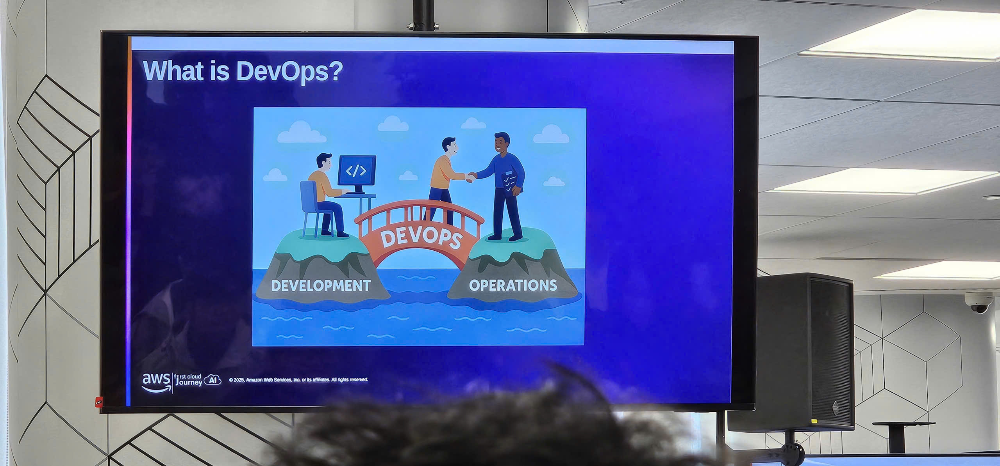
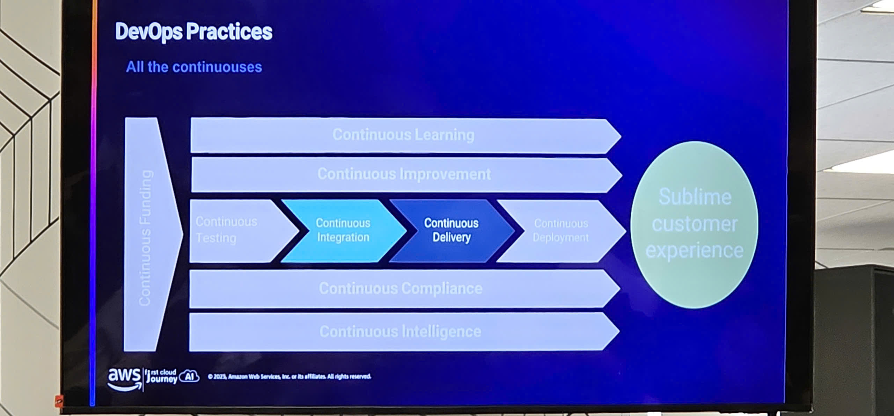
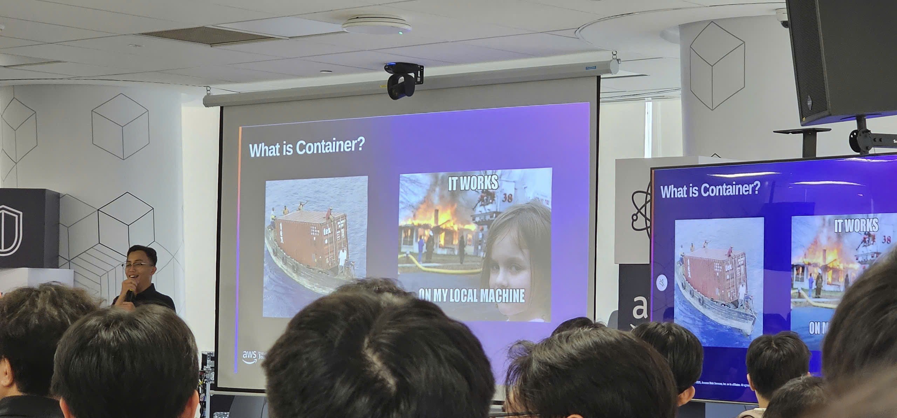
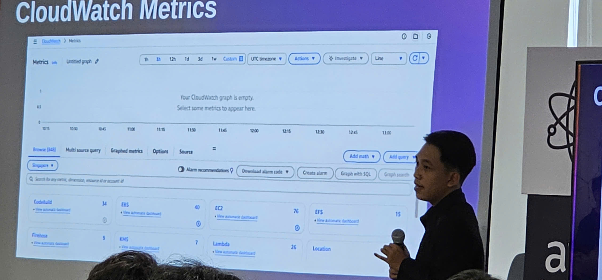
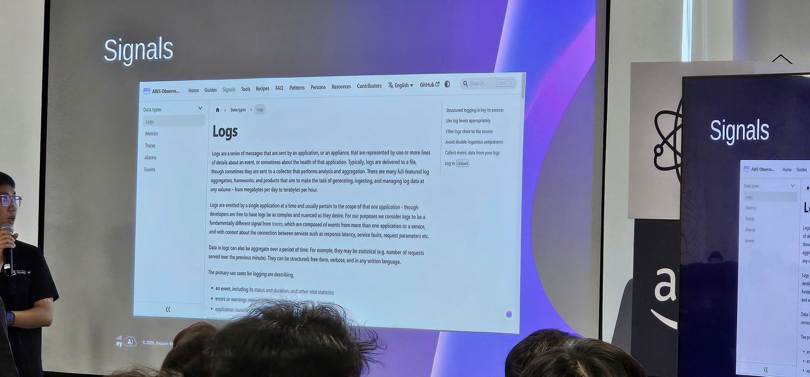

# ⚙️ Workshop DevOps trên AWS

### 🎯 Mục tiêu Workshop

- Hiểu về các nguyên tắc và văn hóa DevOps trong bối cảnh AWS
- Có trải nghiệm thực hành với CI/CD pipeline và Infrastructure as Code
- Khám phá containerization và orchestration sử dụng các dịch vụ AWS
- Học các best practices về monitoring và observability
- Khám phá các chiến lược DevOps thực tế và lộ trình nghề nghiệp

### 📍 Thông tin Sự kiện

- **Địa điểm**: Tầng 26, Tòa nhà Bitexco Financial Tower, số 2 đường Hải Triều, phường Bến Nghé, Quận 1, Thành phố Hồ Chí Minh
- **Thời gian**: 8:30 Sáng – 5:00 Chiều, Thứ Hai, 17 tháng 11, 2025

### 📋 Chương trình

#### ⏰ 8:30 – 9:00 AM: Chào mừng & Tư duy DevOps
**Diễn giả: Trương Quang Tịnh** – AWS Community Builder

- Tóm tắt buổi AI/ML
- Giới thiệu về văn hóa và nguyên tắc DevOps
- Các chỉ số quan trọng: DORA, MTTR, tần suất triển khai

#### ⏰ 9:00 – 10:30 AM: Dịch vụ AWS DevOps – CI/CD Pipeline
**Diễn giả: Trương Quang Tịnh** – AWS Community Builder

- **Source Control**:
  - AWS CodeCommit
  - Chiến lược Git: GitFlow, Trunk-based development
- **Build & Test**:
  - Cấu hình AWS CodeBuild
  - Testing pipelines
- **Deployment**:
  - AWS CodeDeploy với Blue/Green, Canary, và Rolling updates
- **Orchestration**:
  - Tự động hóa AWS CodePipeline
- **Live Demo**: Hướng dẫn chi tiết CI/CD pipeline

#### ☕ 10:30 – 10:45 AM: Giải lao

- Giải khát và networking

#### ⏰ 10:45 AM – 12:00 PM: Infrastructure as Code (IaC)
**Diễn giả:**
- **Văn Hoàng Kha** – AWS Community Builder – CloudFormation
- **Nguyễn Khánh Phúc Thịnh** – AWS Community Builder – AWS CDK

- **AWS CloudFormation**:
  - Templates, stacks, drift detection
- **AWS CDK (Cloud Development Kit)**:
  - Constructs, reusable patterns, hỗ trợ nhiều ngôn ngữ
- **Live Demo**: Triển khai với CloudFormation và CDK
- **Thảo luận**: Lựa chọn giữa các công cụ IaC

#### 🍽️ 12:00 – 1:00 PM: Nghỉ trưa (Tự túc)

#### ⏰ 1:00 – 2:30 PM: Container Services trên AWS
**Diễn giả: Lê Huỳnh Nghiêm** – AWS Community Builder

- **Docker Fundamentals**:
  - Microservices và containerization
- **Amazon ECR**:
  - Lưu trữ image, scanning, lifecycle policies
- **Amazon ECS & EKS**:
  - Chiến lược triển khai, scaling, orchestration
- **AWS App Runner**:
  - Triển khai container đơn giản hóa
- **Demo & Case Study**: So sánh triển khai Microservices

#### ☕ 2:30 – 2:45 PM: Giải lao

#### ⏰ 2:45 – 4:00 PM: Monitoring & Observability
**Diễn giả: Huỳnh Hoàng Long** – AWS Community Builder

- **Amazon CloudWatch**:
  - Metrics, logs, alarms, dashboards
- **AWS X-Ray**:
  - Distributed tracing và performance insights
- **Live Demo**: Thiết lập observability toàn diện
- **Best Practices**:
  - Alerting, dashboards, quy trình on-call

#### ⏰ 4:00 – 4:45 PM: DevOps Best Practices & Case Studies
**Diễn giả: Phạm Hoàng Quý** – AWS Community Builder

- Chiến lược triển khai: Feature flags, A/B testing
- Automated testing và tích hợp CI/CD
- Quản lý sự cố và postmortems
- Case studies: Startups và chuyển đổi DevOps doanh nghiệp

#### ⏰ 4:45 – 5:00 PM: Q&A & Kết thúc

- Lộ trình nghề nghiệp DevOps
- Lộ trình chứng chỉ AWS

### 🔍 Chủ đề Chuyên sâu & Học tập Trực quan

#### 📈 Đo lường & Chỉ số DevOps

- **DORA Metrics**:
  - Tần suất Triển khai
  - Thời gian Thực hiện Thay đổi
  - Thời gian Phục hồi Trung bình (MTTR)
  - Tỷ lệ Thất bại Thay đổi

- **Chỉ số Bổ sung**:
  - Tỷ lệ thành công/thất bại của build
  - Test coverage và mật độ lỗi
  - Thời gian chu kỳ release và tần suất rollback
  - Uptime hệ thống và độ trễ

- **Công cụ Đo lường**:
  - CloudWatch dashboards và alarms
  - X-Ray traces và service maps
  - Lịch sử thực thi CodePipeline
  - Tích hợp bên thứ ba (Datadog, Prometheus, Grafana)

#### 🧠 Tư duy & Văn hóa DevOps

- **Hợp tác & Trách nhiệm Chung**:
  - "You build it, you run it" – thúc đẩy trách nhiệm
  - Đội ngũ đa chức năng và postmortems không đổ lỗi

- **Tự động hóa Trước tiên**:
  - Công việc thủ công = nợ kỹ thuật
  - Tự động hóa testing, deployment, monitoring, và rollback

- **Học tập Liên tục**:
  - Thất bại nhanh, học nhanh hơn
  - Khuyến khích thử nghiệm và đổi mới

- **Observability & Vòng phản hồi**:
  - Monitoring thời gian thực
  - Phản hồi nhanh từ CI/CD pipelines
  - Chỉ số hướng đến khách hàng

#### 🛠️ Chuỗi công cụ DevOps trên AWS

| Giai đoạn        | Dịch vụ AWS Sử dụng                        | Mục đích                                     |
|------------------|--------------------------------------------|----------------------------------------------|
| Source Control   | CodeCommit, GitHub                         | Quản lý phiên bản và cộng tác                |
| Build & Test     | CodeBuild, CodePipeline                    | Build tự động và thực thi test               |
| Deployment       | CodeDeploy, App Runner, ECS/EKS            | Chiến lược triển khai linh hoạt              |
| IaC              | CloudFormation, CDK                        | Cung cấp và quản lý hạ tầng                  |
| Monitoring       | CloudWatch, X-Ray                          | Observability và cảnh báo                    |
| Security         | IAM, GuardDuty, Secrets Manager            | Kiểm soát truy cập và phát hiện mối đe dọa   |

#### 📚 Tài nguyên Học tập Đề xuất

- **Sách**:
  - *Accelerate* của Nicole Forsgren, Jez Humble, Gene Kim
  - *The Phoenix Project* của Gene Kim, Kevin Behr, George Spafford
  - *DevOps for the Modern Enterprise* của Mirco Hering

- **Khóa học & Labs**:
  - AWS Skill Builder: DevOps Engineer Learning Plan
  - AWS Workshops: CI/CD, Containers, Observability
  - Hands-on labs với AWS Cloud9 và CDK

- **Chứng chỉ**:
  - AWS Certified DevOps Engineer – Professional
  - AWS Certified Solutions Architect – Associate
  - AWS Certified Developer – Associate

### 🔄 Hiểu biết về CI/CD Pipeline

#### 🧪 Continuous Integration

- **Định nghĩa**: Thực hành tích hợp code thường xuyên, lý tưởng là hàng ngày, vào repository chung
- **Lợi ích**:
  - Phát hiện sớm các vấn đề tích hợp
  - Vòng phản hồi nhanh hơn
  - Giảm xung đột merge
- **Best Practices**:
  - Mọi người commit vào mainline hàng ngày
  - Build và test tự động được kích hoạt mỗi commit
  - Sử dụng trunk-based development để đơn giản hóa merging

#### 🚀 Continuous Delivery vs Deployment

| Khía cạnh              | Continuous Delivery                         | Continuous Deployment                        |
|------------------------|---------------------------------------------|----------------------------------------------|
| Trigger                | Phê duyệt thủ công trước production         | Tự động hoàn toàn đến production             |
| Testing                | Test tự động trước staging                  | Test tự động trước production                |
| Quản lý Rủi ro         | Cổng con người cho release cuối cùng        | Yêu cầu rollback và monitoring mạnh mẽ       |
| Use Case               | Ngành được quản lý, release có kiểm soát    | Môi trường tần suất cao, rủi ro thấp         |

- **Công cụ Chính**:
  - GitLab/GitHub Actions
  - AWS CodePipeline
  - Feature flags và canary deployments

#### 🧰 Infrastructure as Code (IaC) Chuyên sâu

- **CloudFormation**:
  - Templates khai báo
  - Phát hiện stack drift
  - Change sets cho cập nhật an toàn

- **AWS CDK**:
  - Code mệnh lệnh trong TypeScript, Python, Java, v.v.
  - Constructs có thể tái sử dụng và các lớp trừu tượng
  - Lý tưởng cho developers quen thuộc với ngôn ngữ lập trình

- **So sánh**:
  - CloudFormation: YAML/JSON, ổn định và trưởng thành
  - CDK: Thân thiện với developer, lặp lại nhanh hơn

#### 🐳 Containerization & Microservices

- **Docker**:
  - Container nhẹ cho môi trường cô lập
  - Lý tưởng cho kiến trúc microservices

- **Amazon ECR**:
  - Container registry bảo mật
  - Quét image và lifecycle policies

- **Amazon ECS vs EKS**:
  - ECS: Đơn giản hơn, orchestration được AWS quản lý
  - EKS: Kubernetes-native, linh hoạt hơn

- **App Runner**:
  - Triển khai đơn giản từ source hoặc container
  - Auto-scaling và HTTPS mặc định

#### 📡 Monitoring & Observability

- **CloudWatch**:
  - Custom metrics, logs, dashboards
  - Alarms cho cảnh báo chủ động

- **AWS X-Ray**:
  - Distributed tracing
  - Trực quan hóa service maps và các điểm nghẽn về độ trễ

- **Best Practices**:
  - Đặt SLOs và SLIs
  - Sử dụng phát hiện bất thường
  - Tích hợp với quy trình phản ứng sự cố

#### 📘 DevOps Best Practices

- **Feature Flags**:
  - Bật/tắt tính năng mà không cần triển khai lại
  - Hỗ trợ A/B testing và rollout dần dần

- **Automated Testing**:
  - Unit, integration, regression, smoke tests
  - Tích hợp CI/CD pipeline

- **Quản lý Sự cố**:
  - Postmortems không đổ lỗi
  - Phân tích nguyên nhân gốc rễ
  - Runbooks và đường dẫn leo thang

- **Case Studies**:
  - Startups: Tốc độ và sự nhanh nhẹn với chi phí tối thiểu
  - Doanh nghiệp: Quản trị, tuân thủ, và quy mô

#### 🎓 Lộ trình Nghề nghiệp & Chứng chỉ

- **Vai trò DevOps**:
  - DevOps Engineer
  - Platform Engineer
  - Site Reliability Engineer (SRE)
  - Cloud Engineer

- **Chứng chỉ**:
  - AWS Certified DevOps Engineer – Professional
  - AWS Certified Solutions Architect – Associate
  - AWS Certified Developer – Associate

- **Tài nguyên Học tập**:
  - AWS Skill Builder
  - Free-tier labs với SageMaker và CodePipeline
  - Community meetups và webinars

### 🧪 Chiến lược Testing Liên tục

- **Testing không phải là một giai đoạn**: Nó phải được tích hợp qua tất cả các giai đoạn của pipeline
- **Shift-left testing**: Bắt đầu testing sớm trong chu kỳ phát triển
- **Các loại test qua pipeline**:
  - Lint checks và phân tích tĩnh tại commit
  - Unit và integration tests trong build
  - Regression và exploratory tests trước release
  - Smoke, performance, và security tests trong staging và production

- **Microservices Testing**:
  - Xác thực tính độc lập và khả năng tương tác của service
  - API contract testing và khả năng phục hồi phụ thuộc
  - Hiệu suất tổng hợp qua các hệ thống phân tán

- **Containerized Testing**:
  - Sử dụng Docker containers cho môi trường test cô lập
  - Tách công cụ test và artifacts vào các container chuyên dụng
  - Khởi chạy sandboxes ngắn hạn cho xác thực CI

### 🏗️ Tối ưu hóa CI/CD Pipeline

- **Điều kiện tiên quyết Build Tự động**:
  - Scripts đa giai đoạn dựa trên CLI
  - Tự động hóa có thể lặp lại, đáng tin cậy, và có khả năng rollback
  - Khả năng hiển thị vào metrics và sức khỏe build

- **Lý do để Fail một Build**:
  - Lỗi biên dịch
  - Vi phạm code style và cảnh báo quá mức
  - Thất bại unit và functional test
  - Vi phạm kiến trúc và test chậm

- **Monitoring Sức khỏe Build**:
  - Theo dõi tỷ lệ thành công/thất bại và thời lượng build
  - Dashboards trực quan cho phân tích xu hướng
  - Quy trình phân loại cho các build thất bại

- **Mở rộng Hạ tầng CI**:
  - Vertical scaling: các node build mạnh hơn
  - Horizontal scaling: các job song song qua nhiều agents
  - Orchestration dự đoán cho phân bổ tài nguyên trước

### 🔀 Best Practices Branching & Merging

- **Trunk-Based Development**:
  - Một nhánh mainline với continuous integration
  - Tránh các nhánh feature tồn tại lâu
  - Sử dụng feature toggles cho branching trong code

- **Chiến lược Merge**:
  - Pull từ mainline trước khi push thay đổi
  - Commit hàng ngày để giảm độ phức tạp tích hợp
  - Loại bỏ "merge hell" với đồng bộ thường xuyên

- **Version Control Hygiene**:
  - Code reviews và phê duyệt đồng nghiệp
  - Kiểm tra tự động trên pull requests
  - Khả năng hiển thị vào thay đổi của team và trạng thái ứng dụng

### 🧩 Xây dựng Chuỗi công cụ DevOps của bạn

| Danh mục   | Mục đích                                     | Công cụ Ví dụ                      |
|------------|----------------------------------------------|------------------------------------|
| Code       | Phát triển, review, versioning               | Git, GitHub, CodeCommit            |
| Build      | Công cụ CI và trạng thái build               | Jenkins, CodeBuild, GitLab CI      |
| Test       | Xác thực hiệu suất và chất lượng             | JUnit, Selenium, Postman           |
| Package    | Lưu trữ artifact và pre-deployment           | ECR, Maven, NPM, Artifactory       |
| Release    | Tự động hóa deployment                       | CodeDeploy, Spinnaker, Harness     |
| Validate   | Quản lý thay đổi và phê duyệt                | Jira, ServiceNow, AWS Change Manager|

### 🔐 Bảo mật trong DevOps Pipelines

#### 🛡️ Tích hợp Bảo mật vào CI/CD

- **Bảo mật cấp Code**:
  - Phân tích code tĩnh cho lỗ hổng
  - Phát hiện secrets và quét thông tin xác thực
  - Quét phụ thuộc cho CVEs đã biết

- **Bảo mật thời điểm Build**:
  - Quét container image (Amazon ECR, Snyk, Sysdig)
  - Các bước xác thực sử dụng CodeBuild
  - Thực thi policy với AWS IAM và SCPs

- **Bảo mật thời điểm Deployment**:
  - Guardrails cho môi trường deployment
  - Kiểm soát truy cập dựa trên vai trò cho CodeDeploy và ECS
  - Lưu trữ artifact bảo mật và policies truy cập

- **Bảo mật Runtime**:
  - Monitoring với CloudWatch và GuardDuty
  - Bảo vệ runtime với AWS Inspector và Trend Micro
  - Logging và cảnh báo cho hành vi bất thường

#### 🔄 Thiết kế Pipeline Tăng dần

- **Phương pháp Validation-first**:
  - Thêm xác thực CodeBuild trước deployment
  - Sử dụng test tự động để kiểm soát tiến trình
  - Fail nhanh để giảm rủi ro downstream

- **Bảo mật như một giai đoạn**:
  - Chèn kiểm tra bảo mật sau build, trước deploy
  - Tích hợp với công cụ đối tác (ví dụ: Snyk, Trend Micro)
  - Đảm bảo tuân thủ trước khi release production

- **Tích hợp Hệ sinh thái Đối tác**:
  - GitLab, CircleCI, CloudBees cho CI orchestration
  - Harness và JFrog cho tự động hóa release
  - Snyk và Sysdig cho quét bảo mật

### 🧱 Xây dựng Nền tảng DevOps Self-Service

- **Trao quyền cho Developer**:
  - Sử dụng AWS Service Catalog cho templates được tuyển chọn
  - Cung cấp CloudFormation stacks cho cung cấp hạ tầng
  - Trao quyền cho teams với các module IaC có thể tái sử dụng

- **Kiến trúc Nền tảng**:
  - CodePipeline + CodeBuild cho CI/CD orchestration
  - ECR cho quản lý container image
  - ECS/Fargate cho triển khai container có thể mở rộng

- **Quản trị & Khả năng Mở rộng**:
  - Templates tập trung với tham số hóa
  - Truy cập dựa trên vai trò và audit logging
  - Cải tiến liên tục qua vòng phản hồi

### 📄 Buildspec Mẫu cho CodeBuild

```yaml
version: 0.2
phases:
  install:
    runtime-versions:
      nodejs: 14
    commands:
      - echo Logging in to Amazon ECR...
      - aws ecr get-login-password --region $AWS_DEFAULT_REGION |
        docker login --username AWS --password-stdin $AWS_ACCOUNT_ID.dkr.ecr.$AWS_DEFAULT_REGION.amazonaws.com
  pre_build:
    commands:
      - echo Build started on `date`
      - npm install && npm run build
      - cp -r dist/* ./flaskapp
  build:
    commands:
      - docker build -t $IMAGE_REPO_NAME:$IMAGE_TAG_LATEST .
      - docker tag $IMAGE_REPO_NAME:$IMAGE_TAG_LATEST $AWS_ACCOUNT_ID.dkr.ecr.$AWS_DEFAULT_REGION.amazonaws.com/$IMAGE_REPO_NAME:$IMAGE_TAG_LATEST
  post_build:
    commands:
      - echo Build completed on `date`
```

### 📊 Monitoring với CloudWatch

#### 🔍 CloudWatch Metrics

- **Định nghĩa**: Metrics là các điểm dữ liệu phản ánh hiệu suất hệ thống
- **Nguồn**:
  - Metrics dịch vụ AWS mặc định (EC2, RDS, Lambda, v.v.)
  - Custom metrics qua CloudWatch Agent
  - Hệ thống on-premises qua tích hợp hybrid
- **Tích hợp**:
  - EventBridge cho tự động hóa event-driven
  - Auto Scaling dựa trên ngưỡng metric
  - Quy trình DevOps cho cảnh báo và khắc phục

#### 📁 CloudWatch Logs

- **Nguồn Log**:
  - Dịch vụ AWS (Lambda, ECS, API Gateway, v.v.)
  - Application logs qua CloudWatch Agent
- **Khả năng**:
  - Thu thập và lưu trữ log tập trung
  - Truy vấn logs sử dụng CloudWatch Logs Insights
  - Trực quan hóa xu hướng và bất thường

#### 📈 CloudWatch Dashboards

- **Tính năng**:
  - Kết hợp metrics, logs, và alarms vào giao diện trực quan
  - Widgets tùy chỉnh cho các view phù hợp
  - Dashboards có thể chia sẻ cho khả năng hiển thị của team
- **Use Cases**:
  - Monitoring sức khỏe hệ thống thời gian thực
  - Tóm tắt điều hành và theo dõi SLA
  - Tương quan cảnh báo và phân tích sự cố

### 🔦 Distributed Tracing với AWS X-Ray

#### 🧭 Tổng quan X-Ray

- **Mục đích**: Phân tích và debug các ứng dụng phân tán
- **Tính năng Chính**:
  - Tracing request end-to-end qua microservices
  - Service maps để trực quan hóa đường dẫn request
  - Xác định điểm nghẽn hiệu suất
  - Tích hợp với CloudWatch cho observability thống nhất

#### 🧪 Triển khai X-Ray

- **Tích hợp SDK**:
  - Thêm X-Ray SDK vào application code
  - Tự động tạo trace IDs
- **Hỗ trợ OpenTelemetry**:
  - Sử dụng AWS Distro for OpenTelemetry (ADOT)
  - Xuất dữ liệu telemetry sang X-Ray qua OTLP gRPC
- **Tương thích Container**:
  - Hoạt động với ECS, EKS, và Fargate
  - Tracing dựa trên Sidecar hoặc agent

#### 📊 X-Ray Insights

- **Trace Analytics**:
  - Phân tích độ trễ theo service
  - Tỷ lệ lỗi và cô lập lỗi
  - Phân tích nguyên nhân gốc rễ cho các giao dịch chậm
- **Service Maps**:
  - Trực quan hóa phụ thuộc và luồng traffic
  - Xác định hotspots và các service hoạt động kém

### 🧩 Tóm tắt & Các bước Tiếp theo

#### ✅ Những gì Bạn đã Học

- Có được hiểu biết rõ ràng về tư duy DevOps và văn hóa cộng tác trong phát triển phần mềm hiện đại
- Thành thạo quy trình CI/CD sử dụng các dịch vụ AWS như CodeCommit, CodeBuild, CodeDeploy, và CodePipeline
- Áp dụng Infrastructure as Code (IaC) với CloudFormation và CDK để tự động hóa cung cấp hạ tầng
- Triển khai các ứng dụng containerized sử dụng ECS, EKS, và App Runner
- Thiết lập monitoring và observability với CloudWatch và X-Ray
- Tích hợp bảo mật vào DevOps pipelines và tận dụng các công cụ đối tác AWS cho bảo vệ nâng cao
- Xây dựng nền tảng DevOps self-service cho các team phát triển

#### 🚀 Hành trình Phía trước của Bạn

- **Thực hành**: Bắt đầu với một dự án nhỏ và xây dựng một CI/CD pipeline đơn giản trên AWS
- **Tối ưu hóa**: Tích hợp monitoring, bảo mật, và continuous testing vào quy trình DevOps của bạn
- **Mở rộng**: Xây dựng nền tảng DevOps chung cho nhiều team phát triển
- **Kết nối**: Tham gia AWS Vietnam Community để học hỏi và chia sẻ kinh nghiệm
- **Chứng chỉ**: Lên kế hoạch theo đuổi các chứng chỉ AWS như DevOps Engineer Professional hoặc Solutions Architect Associate

#### 🎯 Thông điệp Cuối cùng

DevOps không chỉ là về công cụ hay quy trình—đó là một tư duy về đổi mới, cộng tác, tự động hóa, và cải tiến liên tục. Với hệ sinh thái AWS, bạn có thể xây dựng các hệ thống mạnh mẽ, có thể mở rộng, và bảo mật cho các tổ chức ở mọi quy mô.

#### 📸 Hình ảnh Sự kiện


<hr>


<hr>


<hr>


<hr>



> Bắt đầu từ những bước nhỏ, học hỏi từ kinh nghiệm thực tế, và không ngừng cải thiện. DevOps là một hành trình, không phải đích đến.
